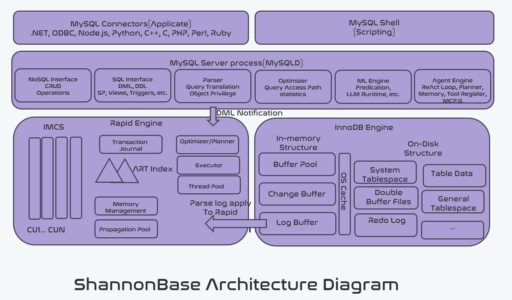
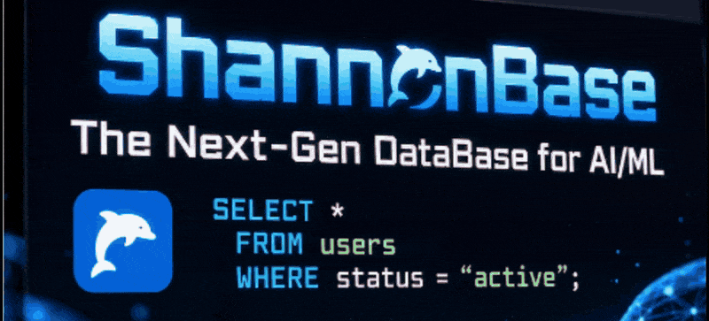

[](./LICENSE)
[](https://www.mysql.com/)


  **Train ML models. Run LLMs. Search vectors. Build RAG pipelines. Run Native-Agent or User-defined Agents.
    All in SQL. Zero extra infrastructure.**

---

## 💡 Why ShannonBase?

Most AI application stacks look like this:

```
MySQL ──► ETL pipeline ──► Vector DB ──► Feature Store ──► Inference Server ──► App
```

Every hop means latency, operational burden, and data synchronization risk.

**ShannonBase collapses this into one engine:**

```
ShannonBase  ──────────────────────────────────────────────────────────────►  App
             (OLTP + OLAP + Vector + ML Training + LLM Inference + RAG)
```

| Capability | Typical Stack | ShannonBase |
|---|---|---|
| Vector Search | Pinecone / Weaviate / pgvector (separate deploy) | Native SQL — built into the engine |
| ML Training | Export data → Python → reimport model | `CALL sys.ML_TRAIN(...)` on live data |
| LLM Inference | External API or separate inference server | ONNX Runtime embedded — runs locally |
| RAG Pipeline | LangChain + vector DB + glue code | `CALL sys.ML_RAG(...)` — one call |
| **Agent Execution** | **LangGraph / AutoGen + orchestration layer + external tools** | **Built-in agent engine — define & run agents via SQL** |
| OLAP Analytics | Kafka + ClickHouse / Spark | Rapid columnar engine — same node |
| MySQL Compatibility | Migration required | Wire-protocol compatible — drop-in |
> Your existing MySQL drivers, ORMs, and tools (Navicat, DBeaver, SQLAlchemy, etc.) work without modification.
---

## 🚀 Quickstart

### Option A — Docker (recommended)

```bash
docker run -d \
  --name shannonbase \
  -p 3306:3306 \
  -e MYSQL_ROOT_PASSWORD=yourpassword \
  shannondata/shannonbase_ubuntu:latest

mysql -h 127.0.0.1 -P 3306 -u root -p  
```

### Option B — Build from Source

See [Build from Source](#-build-from-source) below.

---

## 🧪 Try It in 5 Minutes

### Case 1: Run an LLM locally

```
-- Generate text using a locally loaded ONNX model
SELECT sys.ML_GENERATE(
  'Explain HTAP databases in one paragraph.',
  JSON_OBJECT(
    'task',               'generation',
    'model_id',           'Qwen2.5-0.5B-Instruct',
    'max_tokens',         256,
    'temperature',        0.7
  )
) AS result;
```

### Case 2: JavaScript stored procedures

```
-- Write stored procedures in JavaScript (JerryScript engine)
CREATE PROCEDURE summarize_with_llm(IN doc_id INT)
LANGUAGE JAVASCRIPT AS $$
  sys.exec_sql("select * from xxxx");
  return "summarize_with_llm";
$$;

CALL summarize_with_llm(1);
```
### 📖 More usages ref to [Practices](https://github.com/Shannon-Data/ShannonBase/wiki/Practices)

---

## ✨ Core Features

| Feature | Description |
|---|---|
| 🧠 **In-Database ML** | Built-in LightGBM / XGBoost. Train and predict via `ML_TRAIN`, `ML_PREDICT_ROW`, `ML_MODEL_IMPORT` — no ETL, no Python required |
| 🔍 **Native Vector Search** | First-class `VECTOR` data type + `DISTANCE` functions — no extension install, no separate service |
| 🤖 **LLM / ONNX Runtime** | Run Llama, Qwen, DeepSeek, MiniLM and more **locally inside the DB** via embedded ONNX Runtime |
| 🔗 **RAG Framework** | Full Retrieval-Augmented Generation pipeline via `sys.ML_RAG` — embed, index, retrieve, generate in one SQL call |
| ⚡ **HTAP — Rapid Engine** | InnoDB (row store) + **Rapid** (in-memory columnar store). Real-time Redo Log sync/DML Notification, cost-based + ML-based query routing |
| 🟨 **JavaScript Engine** | JerryScript embedded — write stored procedures/functions in JavaScript alongside SQL |
| 📦 **Multi-Modal Data** | Unified storage for structured, JSON, GIS, and Vector data in one engine |
| 🤝 **Agent-Native** | Built-in agent execution framework; define and run custom agents via SQL |
| 🏗️ **Lakehouse** | Native Parquet file query support (enterprise edition) |
| 🔗 **MySQL 8.0 Compatible** | Full wire-protocol compatibility — your drivers, ORMs, and tooling work as-is |

---

## 🏗️ Architecture
  

ShannonBase: The Next-Gen Database for AI—an infrastructure designed for big data and AI. As the MySQL of the AI era, ShannonBase extends MySQL with native embedding support, machine learning capabilities, a JavaScript engine, and a columnar storage engine. These enhancements empower ShannonBase to serve as a powerful data processing and Generative AI infrastructure.

Firstly, ShannonBase incorporates a columnar store, IMCS (In-Memory Column Store), named Rapid, to transform it into a MySQL HTAP (Hybrid Transactional/Analytical Processing) database. Transactional and analytical workloads are intelligently offloaded to either InnoDB or Rapid using a combination of cost-based and ML-based algorithms. Additionally, version linking is introduced in IMCS to support MVCC (Multi-Version Concurrency Control). Changes in InnoDB are automatically and synchronously propagated to Rapid by applying Redo logs.

Secondly, ShannonBase supports multimodal data types, including structured, semi-structured, and unstructured data, such as GIS, JSON, and Vector.

Thirdly, ShannonBase natively supports LightGBM or XGBoost (TBD), allowing users to perform training and prediction directly via stored procedures, such as ml_train, ml_predict_row, ml_model_import, etc.—eliminating the need for ETL (exporting data and importing trained ML models). Alternatively, pre-trained models can be imported into ShannonBase to save training time. Classification, Regression, Recommendation, Abnormal detection, etc. supported.

Fourthly, By leveraging embedding algorithms and vector data type, ShannonBase becomes a powerful ML/RAG tool for ML/AI data scientists. With Zero Data Movement, Native Performance Optimization, and Seamless SQL Integration, ShannonBase is easy to use, making it an essential hands-on tool for data scientists and ML/AI developers.

At last, ShannonBase Multilingual Engine Component. ShannonBase includes a lightweight JavaScript engine, JerryScript, allowing users to write stored procedures in either SQL or JavaScript. And, built-in Agent and User-defined Agents are all written in Javascript.

**Key design decisions:**

- **HTAP routing** — cost-based + ML-based optimizer selects InnoDB (row) or Rapid (columnar) per query automatically
- **MVCC across both engines** — version linking in IMCS ensures consistent reads across storage formats
- **Dual-channel sync** — Redo Log + DML Notification propagation keeps the columnar store in sync with InnoDB in real time, zero lag. the Redo Log
  abstraction also lays the foundation for a future shared-disk,  cloud-native architecture (à la Aurora / PolarDB)
- **In-process ML runtime** — LightGBM / XGBoost and ONNX models execute inside the database process; no UDF subprocess, no network round-trip to an inference server
- **Embedded ONNX Runtime** — runs Llama, Qwen, DeepSeek, MiniLM and other ONNX-format models locally without an external serving layer
- **JerryScript engine** — lightweight JS VM co-located with the SQL execution layer, shares the same session context

---

## 🔧 Build from Source
### 1: Clone the repo.
```
git clone --recursive git@github.com:Shannon-Data/ShannonBase.git
```
PS: You should ensure that your prerequisite development environment is properly set up.

### 2: Make a directory where we build the source code from.
```
cd ShannonBase && mkdir cmake_build && cd cmake_build
```

### 3: Run cmake and start compilation and installation.
```
 cmake ../ \
  -DWITH_BOOST=/path-to-boost-include-files/ \
  -DCMAKE_BUILD_TYPE=[Release|Debug]  \
  -DCMAKE_INSTALL_PREFIX=/path-to-shannon-bin \
  -DMYSQL_DATADIR=/home/path-to-shannon-bin/data \
  -DSYSCONFDIR=. \
  -DMYSQL_UNIX_ADDR=/home/path-to-shannon-bin/tmp/mysql.sock \
  -DWITH_EMBEDDED_SERVER=OFF \
  -DWITH_MYISAM_STORAGE_ENGINE=1 \
  -DWITH_INNOBASE_STORAGE_ENGINE=1 \
  -DWITH_PARTITION_STORAGE_ENGINE=1 \
  -DMYSQL_TCP_PORT=3306 \
  -DENABLED_LOCAL_INFILE=1 \
  -DEXTRA_CHARSETS=all \
  -DWITH_PROTOBUF=bundled \
  -DWITH_SSL_PATH=/path-to-open-ssl/ \
  -DDEFAULT_SET=community \
  -DWITH_UNIT_TESTS=OFF \
  [-DENABLE_GCOV=1 \ |
  -DWITH_ASAN=1 \    | 
  ]
  -DCOMPILATION_COMMENT="MySQL Community Server, and Shannon Data AI Alpha V.- (GPL)" 

make -j5 && make install

```
PS: in `[]`, it's an optional compilation params, which is to enable coverage collection and ASAN check. And, boost asio 
files are needed, you should install boost asio library at first.

To activate support for the Lakehouse feature, which allows ShannonBase to read Parquet format files, configure the build with the CMake option `-DWITH_LAKEHOUSE=system`. This setting integrates the required Lakehouse dependencies and enables Parquet file processing capabilities within the ShannonBase.

### 4: Initialize the database and run ShannonBase
```
 /path-to-shannbase-bin/bin/mysqld --defaults-file=/path-to-shannonbase-bin/my.cnf --initialize  --user=xxx

 /path-to-shannbase-bin/bin//mysqld --defaults-file=/path-to-shannonbase-bin/my.cnf   --user=xxx & 
```
PS: you should use your own `my.cnf`.

## 📸 Feature Demos
<details>
<summary>Click to expand screenshots</summary>

**Local LLM Inference via `ML_GENERATE`**


**RAG Pipeline via `sys.ML_RAG`**


**In-Database ML Training**


**Native Agent**



</details>

## 📚 Documentation & Demos
- **For detailed documentation, please visit our [GitHub Wiki](https://github.com/Shannon-Data/ShannonBase/wiki).**
- **Watch live demos on our [YouTube Channel](https://www.youtube.com/@ShannonBaseDataAI).**
## 🤝 Contributing

We welcome contributions of all kinds. Areas where help is especially appreciated:

- 📝 **Documentation & tutorials** — usage guides, blog posts, translated docs
- 🧪 **Tests & benchmarks** — unit tests, integration tests, performance comparisons
- 🔌 **Integrations** — LangChain, LlamaIndex, Dify, AutoGen, Superset, Grafana
- 🐛 **Bug reports & fixes** — especially for edge cases in ML / vector / HTAP features
- 🌐 **New language bindings** — Python UDFs, extended JS capabilities

Please read [CONTRIBUTING.md](./CONTRIBUTING.md) before submitting a pull request.

## 📄 License
ShannonBase is released under the [GNU General Public License v2.0](./LICENSE), consistent with MySQL Community Server.