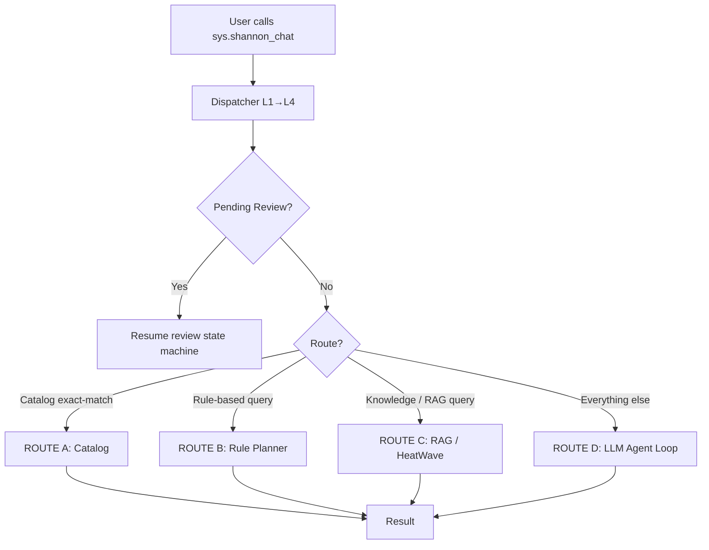

# ShannonBase Agent — How to Use / 使用说明

本文介绍 Agent 的定位、调用入口、执行流程、核心组件、`chat_options` 配置方式，以及如何将 Agent 与数据库场景结合使用。

> **Last updated**: 2026-07-21 — reflects the 4-route architecture, 11-tool dispatch, duplicate/empty-output safety nets, and `final_summary` raw-SQL fallback guards.

## Table of contents / 目录

- [1. Overview / 概述](#1-overview--概述)
- [2. Calling the Agent / 调用方式](#2-calling-the-agent--调用方式)
  - [2.1 Setting chat_options / 设置 chat_options](#21-setting-chat_options--设置-chat_options)
  - [2.2 Basic entry / 基本入口](#22-basic-entry--基本入口)
  - [2.3 Multi-turn conversation / 多轮对话](#23-multi-turn-conversation--多轮对话)
  - [2.4 Review / approval flow / 审批流](#24-review--approval-flow--审批流)
- [3. Agent architecture / Agent 架构](#3-agent-architecture--agent-架构)
  - [3.1 Dispatcher chain (L1→L4) / 调度链](#31-dispatcher-chain-l1l4--调度链)
  - [3.2 Route selection / 路由选择](#32-route-selection--路由选择)
  - [3.3 Route D: LLM Agent Loop in detail / Route D 详解](#33-route-d-llm-agent-loop-in-detail--route-d-详解)
- [4. Tools available / 可用工具](#4-tools-available--可用工具)
- [5. chat_options reference / chat_options 字段说明](#5-chat_options-reference-keys-explained--chat_options-字段说明)
- [6. Safety nets & response quality / 安全网与响应质量](#6-safety-nets--response-quality--安全网与响应质量)
- [7. Audit, persistence and rollback / 审计、持久化与回滚](#7-audit-persistence-and-rollback--审计持久化与回滚)
- [8. Practical tips / 实用建议](#8-practical-tips--实用建议)
- [9. Example chat_options object / 示例对象](#9-example-chat_options-object--示例对象)
- [10. Common scenarios / 常见使用场景](#10-common-scenarios--常见使用场景)
- [11. FAQ / 常见问题](#11-faq--常见问题)
- [12. Example walkthrough / 示例演练](#12-example-walkthrough--示例演练)
- [13. Best practices / 最佳实践](#13-best-practices--最佳实践)
- [14. Troubleshooting / 故障排查](#14-troubleshooting--故障排查)
- [15. Quick start / 快速开始](#15-quick-start--快速开始)

---

# 1. Overview / 概述

ShannonBase Agent 是一个面向数据库场景的对话式 Agent，核心入口是 `sys.shannon_chat(user_message, conversation_id)`。它能够理解自然语言请求，生成 SQL 或工具调用，并在数据库环境中安全执行、验证和返回结果。

ShannonBase Agent is a database-oriented conversational agent built around `sys.shannon_chat(user_message, conversation_id)`. It understands natural language, generates SQL or tool calls, executes them safely, and returns human-readable answers. It supports read-only analysis, write operations, multi-step planning, review/approval pauses, history tracking, and audit logging.

**Key capabilities / 核心能力：**

- 11 built-in tools: `query_db`, `explain_sql`, `plan_sql`, `begin_tx`/`commit_tx`/`rollback_tx`, `update_data`, `list_tables`, `describe_table`, `ml_rag`, `generate_text`
- 4 execution routes: Catalog exact-match, Rule Planner, RAG/HeatWave, LLM Agent Loop
- 4-level dispatcher chain: session variable → plugin table → db-local function → built-in
- Review/approval state machine for write/DDL/risky operations
- Transaction lease system with automatic safety-net rollback
- Token-budget-aware schema context building with fallback
- Duplicate detection, empty-output guards, and raw-SQL-output safety nets
- Conversation memory with vector embeddings for few-shot retrieval

---

# 2. Calling the Agent / 调用方式

## 2.1 Setting chat_options / 设置 chat_options

Before calling the agent, configure `chat_options` with model, RAG, and behavior settings.
在调用 Agent 之前，应先通过 `SET @chat_options` 配置模型、RAG 以及行为参数。

```sql
SET @chat_options = JSON_OBJECT(
  'model_options', JSON_OBJECT(
    'provider',           'deepseek',
    'model_id',           'deepseek-v4-pro',
    'api_key',            'sk-',
    'deepseek_thinking',  'true',
    'reasoning_effort',   'high',
    'language',           'zh',
    'max_tokens',         8192
  ),
  'plan_log_max_tokens', 8000,
  'summary_max_tokens',  3000,
  'retrieve_top_k',      8,
  'history_length',      5
);
```

## 2.2 Basic entry / 基本入口

```sql
SET @s = UUID();
SELECT sys.shannon_chat('列出当前实例中有哪些数据库', @s) AS answer;
```

## 2.3 Multi-turn conversation / 多轮对话

相同的 `conversation_id` 会保持上下文、历史记录以及等待中的执行计划。
The same `conversation_id` preserves context, history, and pending approval plans.

```sql
SET @s = UUID();
SET @chat_options = JSON_OBJECT(
  'model_options', JSON_OBJECT('provider', 'deepseek', 'model_id', 'deepseek-v4-pro', 'api_key', 'sk-'),
  'history_length', 5
);
SELECT sys.shannon_chat('帮我查看订单表结构', @s) AS answer;
SELECT sys.shannon_chat('再帮我统计最近 7 天的异常订单', @s) AS answer;
```

## 2.4 Review / approval flow / 审批流

当启用审批流时，Agent 在生成高风险步骤计划后会暂停，等待用户回复 `Approve` / `Reject` / `Modify:SQL`。
When review mode is enabled, the agent pauses after building a plan for risky steps. Reply with `Approve`, `Reject`, or `Modify:SQL`.

---

# 3. Agent architecture / Agent 架构

## 3.1 Dispatcher chain (L1→L4) / 调度链

The `sys.shannon_chat` entrypoint delegates to a **4-level dispatcher** that resolves which agent function to call:

| Level | Source | Mechanism |
|-------|--------|-----------|
| **L1** | `@shannon_agent_plugin` session variable | Format: `schema.func`. If the function exists → call it. |
| **L2** | `mysql.shannon_agent_plugins` table | Query enabled plugins ordered by `priority ASC, created_at ASC`. First successful call wins. |
| **L3** | `{current_db}.shannon_agent()` function | If a function named `shannon_agent` exists in the current database → call it. |
| **L4** | `sys.shannon_agent_default()` | Built-in fallback — always available. Contains the full compiled agent JS. |

All 4 levels receive the same `(user_message, conversation_id)` signature.

## 3.2 Route selection / 路由选择

Once the dispatcher resolves to the built-in agent (L4), `shannon_agent_run()` first checks for **pending review commands** (`Approve`/`Reject`/`Modify`), then selects one of 4 routes:



| Route | Trigger | Description | Max Turns |
|-------|---------|-------------|-----------|
| **Pending Review** | `Approve`/`Reject`/`Modify:SQL` in user message | Resumes a paused review plan; transitions steps through the state machine | N/A |
| **A: Catalog** | `catalog_match()` returns a hit | Exact schema/object name match → runs canned SQL directly | 1 |
| **B: Rule Planner** | `rule_planner()` returns non-null | Schema/DDL introspection with a mini-loop for `describe_table`/`query_db` | 5 |
| **C: RAG** | `is_knowledge_query()` returns true | Knowledge-base query → discovers vector tables → dispatches via HeatWave | 1 |
| **D: LLM Agent Loop** | Fallback for everything else | Full LLM-driven agent loop with tool execution, review pauses, and safety nets | **10** |

## 3.3 Route D: LLM Agent Loop in detail / Route D 详解

This is the most important route — where the LLM reasons, calls tools, and synthesizes answers.

### Per-turn processing

```
for turn = 0..9 (MAX_TURNS=10):
  1.  ml_generate(full_prompt)           → LLM output
  2.  parse_tool_call(llm_out)            → extract JSON tool object
  3.  If no tool JSON:
        - LLM text exists → use as agent_response, break
        - LLM text empty  → force final_summary (safety net)
  4.  Duplicate tool detection:
        - Same tool+args as previous turn?
        - Yes → force final_summary (safety net), break
  5.  validate_tool_call()                → check args validity
  6.  evaluate_step_policy()              → review/approval check
        - 'pause' → save review plan, return approval prompt
        - 'reject' → policy rejection
        - 'allow' → execute
  7.  execute_review_step()               → run the tool
  8.  log_sql_trace()                     → audit logging
  9.  Update tool_log, last_result, error_count
  10. Check special tools:
        - plan_sql     → break (plan complete)
        - commit_tx / rollback_tx → break
        - generate_text → use result as agent_response, break (or force summary if empty)
  11. Token budget check (PROMPT_TOK_LIMIT=102800):
        - Budget exceeded for write intent → abort with message
        - Otherwise → continue (will trigger final_summary later)
  12. Append result to full_prompt, continue loop
```

### Post-loop processing

```
1. Transaction safety net: force-rollback any uncommitted transaction
2. If need_summary → call final_summary(system_prompt_base, tool_log)
   - final_summary calls ml_generate() with temperature=0.3
   - Synthesizes natural-language answer from all tool outputs
3. Raw SQL output detection (safety net):
   - Detects patterns: "共 N 条", "---" separators, pipe-delimited tables
   - Forces final_summary re-call if raw SQL leaked through
4. JSON tool-call detection (safety net):
   - If response starts with '{' and contains "tool" → force final_summary
5. Persist to agent_memory with embeddings
6. Save chat_options with response
```

### Safety nets (added 2026-07-21)

| Safety Net | Trigger | Action |
|------------|---------|--------|
| Empty LLM output | `parse_tool_call` returns null AND `llm_out` is empty/whitespace | Forces `final_summary` instead of falling back to raw `last_result` |
| Duplicate tool call | Same `tool\|JSON.stringify(args)` as a previous turn | Forces `final_summary` instead of using raw `last_result` |
| Empty `generate_text` | `generate_text` tool returns empty result | Forces `final_summary` instead of silent fallback |
| Raw SQL output guard | Response contains `共 N 条`, `---`, or pipe-delimited table | Forces `final_summary` re-call |

---

# 4. Tools available / 可用工具

All 11 tools are dispatched by `execute_tool()` in `lib_tools.js`. The LLM outputs JSON like `{"thought":"...","tool":"query_db","args":{"sql":"SELECT ..."}}`.

| Tool | Category | Description | Constraints |
|------|----------|-------------|-------------|
| `query_db` | Read | Execute read-only SQL (SELECT/SHOW/DESC/EXPLAIN/WITH) | Rejects write statements; auto-recovers unknown tables |
| `explain_sql` | Read | Run `EXPLAIN FORMAT=JSON` and parse the execution plan | Read-only; warns on full table scans |
| `plan_sql` | Multi-step | Execute an ordered list of read-only SQL steps | Max 15 steps; all must be read-only |
| `begin_tx` | Transaction | Start a transaction with a lease in `mysql.agent_tx_lease` | Rejects duplicate; single-session ownership |
| `update_data` | Write | Execute INSERT/UPDATE/DELETE/REPLACE within a transaction | Requires active tx; UPDATE/DELETE must have WHERE |
| `commit_tx` | Transaction | Commit the current transaction | Requires active tx; clears lease |
| `rollback_tx` | Transaction | Rollback the current transaction | Idempotent; clears lease |
| `list_tables` | Schema | List tables in the current database | Optional `keyword` for filtered search |
| `describe_table` | Schema | Get full column definitions + FOREIGN KEY for table(s) | 1-5 tables per call |
| `ml_rag` | RAG | Retrieve relevant context via vector search | Delegates to `ml_rag()` in `lib_ml.js` |
| `generate_text` | LLM | Raw LLM text generation | Passes prompt directly to `ml_generate()` |

---

# 5. `chat_options` reference (keys explained) / `chat_options` 字段说明

Below are all recognized `chat_options` keys. Each entry shows name, type, default, and explanation in both languages.

| Key | Type | Default | Description / 说明 |
|-----|------|---------|---------------------|
| `model_options` | JSON object | `{}` | Model provider, model ID, API key, and per-model parameters (thinking, reasoning_effort, language, max_tokens, etc.) |
| `plan_log_max_tokens` | Integer | 8000 | Max tokens for planning/reasoning log |
| `summary_max_tokens` | Integer | 3000 | Max tokens for final summary response |
| `retrieve_top_k` | Integer | 8 | Number of top-K results from RAG/schema store |
| `chat_history` | Array | `[]` | Conversation history `[{user_message, chat_bot_message, chat_query_id}]` |
| `history_length` | Integer | 5 | How many recent turns to load into the LLM prompt |
| `review_mode` | String | `'off'` | `'review'` enables approval flow for write/DDL/risky steps |
| `auto_execute_read_only` | Boolean | `true` | Auto-execute SELECT/SHOW even in review mode |
| `require_approval_for_write` | Boolean | `true` | Require approval for INSERT/UPDATE/DELETE |
| `require_approval_for_risky_sql` | Boolean | `true` | Require approval for DROP/TRUNCATE/large DELETE |
| `response` | String | — | Last assistant response (set by agent) |
| `request_completed` | Boolean | `false` | Set to `true` when agent finishes processing |
| `re_run` | Boolean | `false` | Re-run flag for retry scenarios |
| `chat_query_id` | String | — | Unique ID for this query turn |
| `tables` | Array | `[]` | Optional list of table names for schema focus |

### Example `model_options` sub-object:

```json
{
  "provider": "deepseek",
  "model_id": "deepseek-v4-pro",
  "api_key": "sk-...",
  "deepseek_thinking": "true",
  "reasoning_effort": "high",
  "language": "zh",
  "max_tokens": 8192,
  "temperature": 0.25,
  "top_p": 0.95,
  "repeat_penalty": 1.1
}
```

---

# 6. Safety nets & response quality / 安全网与响应质量

The agent includes multiple layers of protection to prevent raw SQL output, empty responses, and infinite loops from reaching the user:

### During the agent loop

| Mechanism | What it prevents |
|-----------|-----------------|
| **MAX_TURNS = 10** | Infinite loops — agent stops after 10 LLM turns |
| **MAX_ERRORS = 3** | Error cascades — stops after 3 consecutive validation/execution errors |
| **Duplicate detection** | LLM repeating the same tool call — forces summary |
| **Empty LLM output guard** | LLM returning whitespace — forces summary instead of raw `last_result` |
| **Empty `generate_text` guard** | `generate_text` tool returning empty — forces summary |
| **Token budget (102,800)** | Prompt overflow — forces summary when near limit |
| **Transaction safety net** | Uncommitted transactions — auto-rollback in `finally` block |
| **TX turn limit (3)** | Stalled transactions — warns and breaks after 3 turns in same tx |

### Post-loop (before returning to user)

| Guard | Detection Pattern | Action |
|-------|------------------|--------|
| Raw SQL output | `共 N 条` prefix, `---` separators, `\|` table format | Forces `final_summary` |
| Stray JSON tool call | Response starts with `{` and contains `"tool"` | Forces `final_summary` |
| Empty response | No content after all processing | Generic apology message |

### `final_summary` behavior

`final_summary()` synthesizes a natural-language answer from the `tool_log`. It:
- Appends a bilingual header: `【已执行工具及结果】\n[Tool Execution Results]`
- Compresses the tool log to `plan_log_max_tokens` (default 8000)
- Calls `ml_generate()` with `temperature=0.3`, `max_tokens=summary_max_tokens`
- Strictly instructs the LLM: no JSON, no raw data repetition, table/column names must match tool results

---

# 7. Audit, persistence and rollback / 审计、持久化与回滚

### Persistent tables / 持久化表

| Table | Purpose |
|-------|---------|
| `mysql.agent_review_plan` | Stores approval plans with status, steps, description |
| `mysql.agent_review_history` | Records approve/reject/modify actions |
| `mysql.agent_memory` | Conversation memory with role, content, thought, and vector embeddings |
| `mysql.agent_sql_trace` | SQL execution trace log (conversation_id, turn_no, tool, sql_text, result_preview) |
| `mysql.agent_tx_lease` | Transaction lease tracking (conversation_id, plan_id, session_conn_id, expires_at) |
| `mysql.shannon_agent_plugins` | Plugin registry (schema_name, function_name, enabled, priority) |
| `mysql.schema_embeddings` | Schema metadata with vector embeddings for semantic retrieval |

### Transaction lifecycle

```
begin_tx → INSERT into agent_tx_lease
  → update_data (one or more writes)
  → commit_tx → DELETE from agent_tx_lease
  OR rollback_tx → DELETE from agent_tx_lease

Safety net: the finally{} block in shannon_agent_run() always calls
finalize_tx_safety_net(), which force-rolls back any uncommitted tx.
```

---

# 8. Practical tips / 实用建议

- To run safely in production, set `review_mode='review'` plus `require_approval_for_write=true` so data-affecting operations require explicit human confirmation.
- Allow `auto_execute_read_only=true` to keep SELECT/EXPLAIN flows smooth without extra approvals.
- Use `history_length` to tune prompt size — larger values increase cost and token usage. Default is 5.
- For large schemas, the agent automatically detects when context would overflow and falls back to a table-name-only listing with `list_tables`/`describe_table` tools available.
- Monitor `agent_review_history` and `agent_sql_trace` tables for audit and incident response.
- The `chat_options.response` field contains the last answer; `request_completed` indicates whether the agent is waiting for more input.

---

# 9. Example `chat_options` object / 示例对象

A complete `chat_options` JSON including model, RAG, review, and control flags:

```json
{
  "model_options": {
    "provider": "deepseek",
    "model_id": "deepseek-v4-pro",
    "api_key": "sk-...",
    "deepseek_thinking": "true",
    "reasoning_effort": "high",
    "language": "zh",
    "max_tokens": 8192
  },
  "plan_log_max_tokens": 8000,
  "summary_max_tokens": 3000,
  "retrieve_top_k": 8,
  "chat_history": [],
  "history_length": 5,
  "review_mode": "review",
  "auto_execute_read_only": true,
  "require_approval_for_write": true,
  "require_approval_for_risky_sql": true
}
```

---

# 10. Common scenarios / 常见使用场景

## 10.1 Schema inspection / 查看表结构

```sql
SET @s = UUID();
SET @chat_options = JSON_OBJECT(
  'model_options', JSON_OBJECT('provider', 'deepseek', 'model_id', 'deepseek-v4-pro', 'api_key', 'sk-'),
  'review_mode', 'review'
);
SELECT sys.shannon_chat('请帮我查看 orders 和 order_items 表的结构，并说明它们之间的关系', @s) AS answer;
```

## 10.2 Data analysis / 数据分析

```sql
SET @s = UUID();
SET @chat_options = JSON_OBJECT(
  'model_options', JSON_OBJECT('provider', 'deepseek', 'model_id', 'deepseek-v4-pro', 'api_key', 'sk-'),
  'retrieve_top_k', 8
);
SELECT sys.shannon_chat('统计最近 30 天的订单量、支付成功率和平均客单价', @s) AS answer;
```

## 10.3 Safe write / 安全写入

```sql
SET @s = UUID();
SET @chat_options = JSON_OBJECT(
  'model_options', JSON_OBJECT('provider', 'deepseek', 'model_id', 'deepseek-v4-pro', 'api_key', 'sk-'),
  'review_mode', 'review',
  'require_approval_for_write', true
);
SELECT sys.shannon_chat('把最近 7 天内状态为 pending 的订单改成 review', @s) AS answer;
```

## 10.4 Multi-step operation / 多步骤操作

Complex requests are split into steps: inspect schema → build plan → execute → validate.
复杂请求被拆成多步骤：查表结构 → 生成计划 → 执行 → 验证。

---

# 11. FAQ / 常见问题

### Why does the agent pause? / 为什么 Agent 会暂停？

When a step is classified as write/DDL/risky and review mode is enabled, the agent pauses and waits for `Approve`/`Reject`/`Modify:SQL`.

### Can I disable approval? / 如何关闭审批？

Set `review_mode='off'` or disable specific approval flags in `chat_options`.

### How do I change the SQL before execution? / 如何在执行前修改 SQL？

Reply with `Modify:SQL` followed by your corrected SQL. The agent replaces the pending step.

### What if the agent returns raw SQL output? / Agent 返回原始 SQL 结果怎么办？

The latest version (2026-07-21) includes multiple safety nets that detect raw SQL output patterns and automatically call `final_summary` to generate a proper natural-language response. If you still see raw output, check the `agent_sql_trace` table for the tool execution log.

### How do I add a custom agent? / 如何添加自定义 Agent？

Register your function in `mysql.shannon_agent_plugins`:
```sql
INSERT INTO mysql.shannon_agent_plugins (schema_name, function_name, enabled, priority)
VALUES ('my_schema', 'my_custom_agent', 1, 1);
```
The dispatcher (L2) will call it before falling back to the built-in agent.

---

# 12. Example walkthrough / 示例演练

```sql
SET @s = UUID();
SET @chat_options = JSON_OBJECT(
  'model_options', JSON_OBJECT('provider', 'deepseek', 'model_id', 'deepseek-v4-pro', 'api_key', 'sk-'),
  'review_mode', 'review',
  'require_approval_for_write', true
);
SELECT sys.shannon_chat('请帮我把最近 7 天内支付失败且金额大于 100 的订单标记为 review', @s) AS answer;
```

Typical flow:

1. Agent parses the request → enters Route D (LLM Agent Loop)
2. LLM calls `query_db` to inspect the `orders` table
3. LLM calls `plan_sql` to build a multi-step plan
4. Review policy evaluates the write step → pauses for approval
5. Agent returns an approval prompt with plan ID, SQL, risk level
6. User replies `Approve`
7. Agent executes the write and records the result in audit trail

Example approval prompt:

```text
【审批中断】请确认下一步执行：
计划 ID：plan_001
步骤：1/1
工具：update_data
SQL：UPDATE orders SET status='review' WHERE payment_status='failed' AND amount > 100 AND created_at >= NOW() - INTERVAL 7 DAY
影响表：orders
预计影响行数：unknown
会写入/修改结构：是
风险等级：medium

请回复：Approve / Reject / Modify:SQL
```

---

# 13. Best practices / 最佳实践

1. **Start with read-only questions** — begin with inspection and analysis requests before attempting writes.
2. **Keep requests specific** — clearer requests produce clearer plans and fewer surprises.
3. **Enable review mode for writes** — set `review_mode='review'` when the task may change data.
4. **Review SQL before approving** — especially for UPDATE/DELETE/DDL statements.
5. **Reuse conversation IDs** — keep the same `conversation_id` for multi-turn tasks to preserve context.
6. **Check `agent_sql_trace` for debugging** — every SQL execution is logged with turn number and result preview.

---

# 14. Troubleshooting / 故障排查

| Problem | Likely Cause | Solution |
|---------|-------------|----------|
| Agent didn't pause for approval | `review_mode` not set or step classified as read-only | Check `review_mode` in `chat_options` |
| Plan seems too broad | Request too vague | Break into smaller, more specific requests |
| Response is raw SQL output | Old agent version (pre-2026-07-21) | Update to latest code with safety nets |
| Transaction left open | Agent crashed mid-transaction | `finalize_tx_safety_net()` in `finally` block auto-rolls back |
| Response is hex (`0x...`) | Function charset mismatch or client charset | Re-create function with `CHARACTER SET utf8mb4`; connect with `mysql --default-character-set=utf8mb4` |
| Plugin not being called | Priority too low or not enabled | Check `mysql.shannon_agent_plugins` — ensure `enabled=1` and priority is set |

---

# 15. Quick start / 快速开始

### Minimal workflow

1. Start a conversation with a stable `conversation_id` (`UUID()`).
2. Ask a read-only question first to confirm the agent behaves as expected.
3. If the task may change data, enable `review_mode='review'`.
4. Review proposed SQL and reply `Approve`, `Reject`, or `Modify:SQL`.
5. Check `agent_sql_trace` and `agent_memory` for audit trail.

### Common commands

| Command | Effect |
|---------|--------|
| `Approve` | Continue with the current step |
| `Reject` | Cancel the current plan |
| `Modify:SQL` | Replace the pending SQL with your corrected version |

### Quick-start example

```sql
SET @s = UUID();
SET @chat_options = JSON_OBJECT(
  'model_options', JSON_OBJECT('provider', 'deepseek', 'model_id', 'deepseek-v4-pro', 'api_key', 'sk-'),
  'retrieve_top_k', 8,
  'history_length', 5
);
SELECT sys.shannon_chat('帮我查看 orders 表结构', @s) AS answer;
SELECT sys.shannon_chat('再帮我统计最近 7 天的异常订单', @s) AS answer;
```