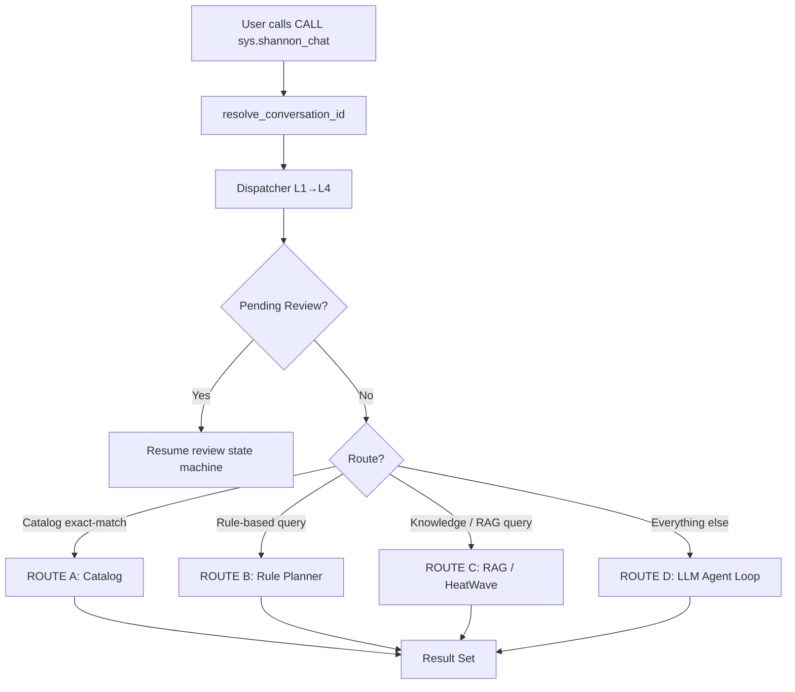

# ShannonBase Agent — How to Use / 使用说明

本文介绍 Agent 的定位、调用入口、执行流程、核心组件、`chat_options` 配置方式，以及如何将 Agent 与数据库场景结合使用。

## Table of contents / 目录

- [1. Overview / 概述](#1-overview--概述)
- [2. Calling the Agent / 调用方式](#2-calling-the-agent--调用方式)
  - [2.1 Setting chat_options / 设置 chat_options](#21-setting-chat_options--设置-chat_options)
  - [2.2 Basic entry / 基本入口](#22-basic-entry--基本入口)
  - [2.3 Multi-turn conversation / 多轮对话](#23-multi-turn-conversation--多轮对话)
  - [2.4 Review / approval flow / 审批流](#24-review--approval-flow--审批流)
- [3. Agent architecture / Agent 架构](#3-agent-architecture--agent-架构)
  - [3.1 Entry point / 入口函数](#31-entry-point--入口函数)
  - [3.2 Dispatcher chain (L1→L4) / 调度链](#32-dispatcher-chain-l1l4--调度链)
  - [3.3 Route selection / 路由选择](#33-route-selection--路由选择)
  - [3.4 Route D: LLM Agent Loop in detail / Route D 详解](#34-route-d-llm-agent-loop-in-detail--route-d-详解)
- [4. Tools available / 可用工具](#4-tools-available--可用工具)
- [5. chat_options reference / chat_options 字段说明](#5-chat_options-reference--chat_options-字段说明)
- [6. Safety nets & response quality / 安全网与响应质量](#6-safety-nets--response-quality--安全网与响应质量)
- [7. Audit, persistence and rollback / 审计、持久化与回滚](#7-audit-persistence-and-rollback--审计持久化与回滚)
- [8. Practical tips / 实用建议](#8-practical-tips--实用建议)
- [9. Example chat_options object / 示例对象](#9-example-chat_options-object--示例对象)
- [10. Common scenarios / 常见使用场景](#10-common-scenarios--常见使用场景)
- [11. FAQ / 常见问题](#11-faq--常见问题)
- [12. Example walkthrough / 示例演练](#12-example-walkthrough--示例演练)
- [13. Best practices / 最佳实践](#13-best-practices--最佳实践)
- [14. Troubleshooting / 故障排查](#14-troubleshooting--故障排查)
- [15. Quick start / 快速开始](#15-quick-start--快速开始)

---

# 1. Overview / 概述

ShannonBase Agent 是一个面向数据库场景的对话式 Agent，核心入口是 `CALL sys.shannon_chat(user_message)`。它通过 `@chat_options` 会话变量接收配置（包括模型、RAG、conversation_id、审批策略等），理解自然语言请求，生成 SQL 或工具调用，并在数据库环境中安全执行、验证和以结果集形式返回答案。

ShannonBase Agent is a database-oriented conversational agent whose entry point is `CALL sys.shannon_chat(user_message)`. It receives configuration through the `@chat_options` session variable (model, RAG, conversation_id, review policy, etc.), understands natural language, generates SQL or tool calls, executes them safely, and returns answers as a result set.

**Key capabilities / 核心能力：**

- 34 built-in tools, defined by a single registry (`register_tool()` in `lib_tool_registry.js`): core SQL (`query_db`, `explain_sql`, `plan_sql`, `update_data`, `run_ddl`), transactions (`begin_tx`/`commit_tx`/`rollback_tx`), schema (`list_tables`, `describe_table`, `check_secondary_load`), retrieval (`ml_rag`, `generate_text`), the `ml_*` AutoML family, and memory (`remember_fact`, `recall_memory`, `forget_memory`). `CALL sys.shannon_agent_selfcheck('tools', NULL, NULL)` prints the live contract.
- 4-layer memory: working (per call) / short-term (rolling summary + recent turns) / long-term episodic + procedural (vector) / long-term semantic facts — all isolated per SQL principal
- 4 execution routes: Catalog exact-match, Rule Planner, RAG/HeatWave, LLM Agent Loop
- 4-level dispatcher chain: session variable → plugin table → db-local function → built-in
- Review/approval state machine for write/DDL/risky operations with CAS protection
- Transaction lease system with automatic safety-net rollback
- Token-budget-aware schema context building with IDF-weighted candidate tables
- Schema catalog caching (TTL-based with fingerprint invalidation)
- Duplicate detection, empty-output guards, and raw-SQL-output safety nets
- Conversation memory with vector embeddings for few-shot retrieval
- Sample row previews for Tier1 tables in schema context
- Auto-continue: omit `conversation_id` to resume last session; set to `"new"` for a fresh one

---

# 2. Calling the Agent / 调用方式

## 2.1 Setting chat_options / 设置 chat_options

Before calling the agent, configure `@chat_options` with model, RAG, conversation_id, and behavior settings.
在调用 Agent 之前，应先通过 `SET @chat_options` 配置模型、RAG、conversation_id 以及行为参数。

```sql
SET @chat_options = JSON_OBJECT(
  'conversation_id', UUID(),
  'model_options', JSON_OBJECT(
    'provider',           'deepseek',
    'model_id',           'deepseek-v4-pro',
    'api_key',            'sk-',
    'deepseek_thinking',  'true',
    'reasoning_effort',   'high',
    'language',           'zh',
    'max_tokens',         8192
  ),
  'rag_options', JSON_OBJECT(
    'vector_store', JSON_ARRAY('mydb.knowledge_base'),
    'n_citations',  6,
    'distance_metric', 'COSINE'
  ),
  'plan_log_max_tokens', 8000,
  'summary_max_tokens',  3000,
  'retrieve_top_k',      8,
  'history_length',      5
);
```

## 2.2 Basic entry / 基本入口

`sys.shannon_chat` is a **PROCEDURE** — call it with `CALL`, not `SELECT`. The result is returned as a result set (column: `response`).

```sql
SET @chat_options = JSON_OBJECT('conversation_id', UUID());
CALL sys.shannon_chat('列出当前实例中有哪些数据库');
```

## 2.3 Multi-turn conversation / 多轮对话

Keep the same `conversation_id` in `@chat_options` to preserve context, history, and pending approval plans.
保持 `@chat_options` 中的 `conversation_id` 不变即可维持上下文、历史记录以及等待中的审批计划。

You can also **omit** `conversation_id` to auto-continue the last conversation on this connection, or set it to `"new"` to force a fresh session.

```sql
-- Start a conversation
SET @chat_options = JSON_OBJECT(
  'conversation_id', UUID(),
  'model_options', JSON_OBJECT('provider', 'deepseek', 'model_id', 'deepseek-v4-pro', 'api_key', 'sk-'),
  'history_length', 5
);
CALL sys.shannon_chat('帮我查看订单表结构');

-- Continue the same conversation — reuse @chat_options, conversation_id auto-continues
CALL sys.shannon_chat('再帮我统计最近 7 天的异常订单');

-- Or auto-continue last session without specifying conversation_id
SET @chat_options = JSON_OBJECT(
  'model_options', JSON_OBJECT('provider', 'deepseek', 'model_id', 'deepseek-v4-pro', 'api_key', 'sk-')
);
CALL sys.shannon_chat('刚才说的订单表，有哪些索引？');

-- Force a fresh conversation
SET @chat_options = JSON_MERGE_PATCH(@chat_options, JSON_OBJECT('conversation_id', 'new'));
CALL sys.shannon_chat('换个话题，帮我看看用户表');
```

## 2.4 Review / approval flow / 审批流

当启用审批流时，Agent 在生成高风险步骤计划后会暂停，等待用户回复 `Approve` / `Reject` / `Modify:SQL`。
When review mode is enabled, the agent pauses after building a plan for risky steps. Reply with `Approve`, `Reject`, or `Modify:SQL`.

The review state machine uses compare-and-swap (CAS) via `claim_review_step()` to prevent concurrent approve/reject/modify on the same step.

---

# 3. Agent architecture / Agent 架构

## 3.1 Entry point / 入口函数

| Object | Type | Signature | Role |
|--------|------|-----------|------|
| `sys.shannon_chat` | **PROCEDURE** | `(IN user_message TEXT)` | User-facing entry. Reads `@chat_options`, resolves `conversation_id`, delegates to dispatcher, returns `response` column via `sys.send_result_set`. |
| `sys.shannon_agent_default` | FUNCTION | `(user_message TEXT, conversation_id VARCHAR(64))` | Standalone entry point to the built-in agent, and the signature plugins mirror. Contains the full compiled agent JS. Not how the dispatcher reaches the agent — see L4. |

## 3.2 Dispatcher chain (L1→L4) / 调度链

`sys.shannon_chat` delegates to a **4-level dispatcher** (`dispatcher()` in `lib_dispatcher.js`) that resolves which agent function to call:

| Level | Source | Mechanism |
|-------|--------|-----------|
| **L1** | `@shannon_agent_plugin` session variable | Format: `schema.func`. If the function exists → call it. |
| **L2** | `mysql.shannon_agent_plugins` table | Query enabled plugins ordered by `priority ASC, created_at ASC`. First successful call wins. |
| **L3** | `{current_db}.shannon_agent()` function | If a function named `shannon_agent` exists in the current database → call it. |
| **L4** | built-in agent, called in-process | Always available. The agent runs inside the `sys.shannon_chat` **procedure** rather than through `sys.shannon_agent_default()`, because a procedure is not a sub-statement and can therefore own a transaction — `begin_tx` / `commit_tx` / `rollback_tx` and the `finally` safety net all work here. A stored function cannot: MySQL restores `option_bits` wholesale when a function returns, so a transaction opened inside one could never survive. Calling `sys.shannon_agent_default()` directly still works, but writes there require the caller to have opened the transaction. |

All 4 levels receive the same `(user_message, conversation_id)` signature.

### Conversation ID resolution / conversation_id 解析

`resolve_conversation_id()` resolves the conversation ID in this order:
1. Explicit `conversation_id` in `@chat_options` (non-empty and not `"new"`)
2. If `"new"` → generate a fresh UUID
3. If omitted → reuse `@_shannon_last_conv_id` from the previous call (auto-continue)
4. Fallback → generate a fresh UUID

## 3.3 Route selection / 路由选择

Once the dispatcher resolves to the built-in agent (L4), `shannon_agent_run()` first checks for **pending review commands** (`Approve`/`Reject`/`Modify`), then selects one of 4 routes:


```mermaid
flowchart TD
    U[User calls CALL sys.shannon_chat] --> CR[resolve_conversation_id]
    CR --> D[Dispatcher L1→L4]
    D --> P{Pending Review?}
    P -->|Yes| R[Resume review state machine]
    P -->|No| RT{Route?}
    RT -->|Catalog exact-match| A[ROUTE A: Catalog]
    RT -->|Rule-based query| B[ROUTE B: Rule Planner]
    RT -->|Knowledge / RAG query| C[ROUTE C: RAG / HeatWave]
    RT -->|Everything else| D2[ROUTE D: LLM Agent Loop]
    A --> O[Result Set]
    B --> O
    C --> O
    D2 --> O
```

| Route | Trigger | Description | Max Turns |
|-------|---------|-------------|-----------|
| **Pending Review** | `Approve`/`Reject`/`Modify:SQL` in user message | Resumes a paused review plan; transitions steps through the state machine with CAS protection | N/A |
| **A: Catalog** | `catalog_match()` returns a hit | Exact schema/object name match → runs canned SQL directly | 1 |
| **B: Rule Planner** | `rule_planner()` returns non-null | Schema/DDL introspection with a mini-loop for `describe_table`/`query_db` | 5 |
| **C: RAG** | `is_knowledge_query()` returns true | Knowledge-base query → discovers vector tables → dispatches via HeatWave | 1 |
| **D: LLM Agent Loop** | Fallback for everything else | Full LLM-driven agent loop with tool execution, review pauses, and safety nets | **10** |

### Schema context building (Route D)

Route D uses IDF-weighted candidate table scoring (`infer_candidate_tables`) to select relevant tables, then builds schema context dynamically:

- **Tier1 tables** (top-N by score): Full DDL with column types, keys, comments, and optional sample rows (2 rows by default)
- **Tier2 tables** (FK-referenced): Compact column listing
- **Overflow**: Truncated table-name-only listing

The schema catalog is cached per-connection (`@schema_catalog_cache_{db}`) with:
- **TTL**: 5 minutes
- **Fingerprint**: COUNT(*) of tables + COUNT(*) of columns — a DDL change invalidates the cache immediately
- Low-value column deprioritization (timestamps like `created_at`/`updated_at`, soft-delete flags) pushes audit columns to the tail so business columns are never silently truncated by the per-table budget

## 3.4 Route D: LLM Agent Loop in detail / Route D 详解

This is the most important route — where the LLM reasons, calls tools, and synthesizes answers.

### Per-turn processing

```
for turn = 0..MAX_TURNS-1:
  0.  Deadline check (TURN_DEADLINE_MS):
        - Elapsed > budget → stop_reason='deadline', force final_summary
        - Checked *before* the model call, so the budget bounds what the
          turn starts rather than what it has already paid for
  1.  ml_generate(full_prompt, {tools:true}) → LLM output + A.last_llm_status
        - On a provider with a tool channel the catalogue goes over that
          channel and the call comes back already parsed; providers without
          one use the JSON-in-text protocol, which is not a degraded mode
        - A failed call is distinguished from a model with nothing to say:
          errors are classified and retried (LLM_MAX_ATTEMPTS=3, backoff),
          and retrying stops once the turn deadline has passed
  2.  A.last_llm_status.tool_call, else parse_tool_call(llm_out)
  3.  If no tool call:
        - LLM text exists → use as agent_response, break
        - LLM text empty  → force final_summary (safety net)
  4.  Duplicate tool detection:
        - Same tool+args as previous turn?
        - Yes → force final_summary (safety net), break
  5.  validate_tool_call()                → check args validity
  6.  evaluate_step_policy()              → review/approval check
        - 'pause' → save review plan, return approval prompt
        - 'reject' → policy rejection
        - 'allow' → execute
  7.  execute_review_step()               → run the tool
  8.  log_sql_trace()                     → audit logging
  9.  Update tool_log, last_result, error_count
  10. Check special tools:
        - plan_sql     → break (plan complete)
        - commit_tx / rollback_tx → break
        - generate_text → use result as agent_response, break (or force summary if empty)
  11. Budget check — two ceilings, either one ends the turn:
        - PROMPT_TOK_LIMIT = prompt_token_budget(): derived from the model's
          own context window, (window - reply_tokens) * 0.85, floor 1000
        - PROMPT_CHAR_LIMIT = prompt_char_budget(): 3/16 of the JavaScript
          engine heap, which the host reports via sys.engine_heap_bytes()
        - Over budget → compact_transcript(), or stop_reason='context_exhausted'
  12. Append result to full_prompt, continue loop
```

`MAX_TURNS` and `TURN_DEADLINE_MS` are not constants. Both come from
`mysql.agent_policy` (defaults: 10 turns, 10 minutes) through the same
one-directional combinator as the read ceilings — an operator may lower them,
a session may not raise them. See §7.

### Post-loop processing

```
1. Transaction safety net: force-rollback any uncommitted transaction
2. If need_summary → call final_summary(system_prompt_base, tool_log)
   - final_summary calls ml_generate() with temperature=0.3
   - Synthesizes natural-language answer from all tool outputs
3. Raw SQL output detection (safety net):
   - Anchored on the exact header rows_to_text()/rows_to_table() emits:
     "共 N 条：" / "Total N rows:". Deliberately *not* on "---" or " | "
     anywhere in the text — final_summary asks the model for a Markdown
     table, and every Markdown table contains both, so the loose test fired
     on essentially every well-formed answer and threw it away
   - Forces final_summary re-call if raw SQL leaked through
4. JSON tool-call detection (safety net):
   - Reuses parse_tool_call() rather than testing charAt(0) === '{', which
     missed JSON wrapped in ```json fences — the most common leakage pattern
5. Stop reason: whatever ended the loop is recorded in A.stop_reason, and
   every ending that is not completion appends a note saying the answer may
   be partial (see §6). 'finish' and 'llm_error' add nothing — the first is
   complete, the second already explains itself
6. Persist to agent_memory with embeddings
7. Save chat_options with response
8. finally{} block: guarantee finalize_tx_safety_net() always runs
```

### Safety nets summary

| Safety Net | Trigger | Action |
|------------|---------|--------|
| Empty LLM output | `parse_tool_call` returns null AND `llm_out` is empty/whitespace | Forces `final_summary` instead of falling back to raw `last_result` |
| Duplicate tool call | Same `tool\|JSON.stringify(args)` as a previous turn | Forces `final_summary` instead of using raw `last_result` |
| Empty `generate_text` | `generate_text` tool returns empty result | Forces `final_summary` instead of silent fallback |
| Raw SQL output guard | Response contains `共 N 条`, `---`, or pipe-delimited table | Forces `final_summary` re-call |

---

# 4. Tools available / 可用工具

Tools are declared once, in a registry, and dispatched from it. One `register_tool({...})` call in `lib_tool_specs_*.js` is the single source of truth for a tool's argument schema, its bilingual error messages, its approval/policy metadata, its execution body, and its entry in the system prompt — `execute_tool()` and `validate_tool_call()` in `lib_tools.js` are now thin facades over `TOOL_REGISTRY`, and `build_system_prompt()` renders the tool catalogue with `render_tool_docs()` instead of carrying a hand-written copy of it.

The LLM outputs JSON like `{"thought":"...","tool":"query_db","args":{"sql":"SELECT ..."}}`.

**The catalogue is budgeted.** It used to be emitted in full on every turn — at 34 tools that is roughly 6.5k characters of Chinese or 9k of English, charged on a turn that only wanted `SHOW TABLES`. Categories now declare whether they are always expanded or expanded on demand (`register_tool_category({name:'ml', expand:'ondemand', match:/…/})`). An on-demand category that the current message does not match collapses to one signature line per tool — `ml_train(table_name, target_column, task?, model_handle?, options?)` — which is enough to call it, and `describe_tool` returns the full entry when it is not. Asking about training a model re-expands the ML family on the *same* turn, not the next one. Measured saving on a non-ML turn: ~31% of the catalogue in Chinese, ~29% in English, with every tool still reachable.

Only `ml` is on demand today. A category with no policy is always expanded, so a new one is visible by default and has to opt into being collapsed — a wrongly expanded category costs tokens, a wrongly hidden one costs a capability the model cannot discover it is missing.

That the table below still matches the implementation is checked by
`CALL sys.shannon_agent_selfcheck('tools', NULL, NULL)` — read-only, a single
`OK` row when everything agrees, and the one self-check an operator has a reason
to run after an upgrade. The remaining self-checks are development tooling that
runs the agent against a scripted model or writes fixture rows; they are not part
of the agent's interface and are documented in [SELFCHECK.md](SELFCHECK.md).

| Tool | Category | Description | Constraints |
|------|----------|-------------|-------------|
| `query_db` | Read | Execute read-only SQL (SELECT/SHOW/DESC/EXPLAIN/WITH) | Rejects write statements; auto-recovers unknown tables via `TABLE_FALLBACK` |
| `explain_sql` | Read | Run `EXPLAIN FORMAT=JSON` and parse the execution plan | Read-only; warns on full table scans |
| `plan_sql` | Multi-step | Execute an ordered list of read-only SQL steps | Max 15 steps (non-review) / 3 steps (review mode); all must be read-only |
| `begin_tx` | Transaction | Start a transaction with a lease in `mysql.agent_tx_lease` | Rejects duplicate via ON DUPLICATE KEY; single-session ownership |
| `update_data` | Write | Execute INSERT/UPDATE/DELETE/REPLACE within a transaction | Requires active tx; UPDATE/DELETE must have WHERE |
| `commit_tx` | Transaction | Commit the current transaction | Requires active tx; clears lease scoped to CONNECTION_ID |
| `rollback_tx` | Transaction | Rollback the current transaction | Idempotent; clears lease scoped to CONNECTION_ID |
| `list_tables` | Schema | List tables in the current database | Optional `keyword` for filtered search; optional `top_k` |
| `describe_table` | Schema | Get full column definitions + FOREIGN KEY for table(s) | Accepts `table_name` (string) or `table_names` (array); 1-8 tables per call |
| `ml_rag` | RAG | Retrieve relevant context via vector search | Delegates to `ml_rag()` in `lib_ml.js`; requires `question` |
| `generate_text` | LLM | Raw LLM text generation | Passes prompt directly to `ml_generate()`; requires `prompt` |
| `run_ddl` | DDL | Run CREATE / ALTER / RENAME (including `SECONDARY_LOAD`/`SECONDARY_UNLOAD`) | Single statement; refused while a transaction is open (DDL implicitly commits). Gated per action class, each refused by default and each enforced regardless of `review_mode`: DROP/TRUNCATE need `allow_destructive_ddl`, accounts and roles need `allow_account_ddl`, stored code needs `allow_code_ddl`, `ALTER INSTANCE`/`RESOURCE GROUP` need `allow_instance_ddl`. Ordinary schema DDL (`CREATE INDEX`, `SECONDARY_LOAD`) stays ungated. |
| `check_secondary_load` | Schema | Report whether a table is loaded into RAPID | `table_name` must be `schema.table` |
| `ml_train` | ML (write) | Train an AutoML model | Table must be `SECONDARY_LOAD`ed first; needs `table_name` + `target_column` |
| `ml_predict_row` / `ml_predict_table` | ML | Single-row / whole-table prediction | `ml_predict_table` writes `output_table`, so it goes through approval |
| `ml_explain` / `ml_explain_row` / `ml_explain_table` | ML | Feature importance and per-prediction explanations | `ml_explain_table` writes `output_table` |
| `ml_score` | ML | Evaluate a trained model | `metric` is one of accuracy/balanced_accuracy/f1/precision/recall/roc_auc/neg_log_loss |
| `ml_model_export` / `ml_model_import` | ML (write) | Move a model in or out of a table | `model_content` must be a prior export table |
| `ml_model_load` / `ml_model_unload` / `ml_model_active` | ML | Model residency in memory | `model_handle` falls back to `@chat_options.handle_model` |
| `ml_list_models` | ML | List trained models for the current schema | Reads `ML_SCHEMA_<db>.MODEL_CATALOG` |
| `ml_embed_table` / `ml_generate_table` / `ml_rag_table` | ML (write) | Batch embedding / generation / RAG over one column | `input_column` and `output_column` must be `DB.Table.Column`; run on InnoDB, no `SECONDARY_LOAD` needed |
| `remember_fact` | Memory (write) | Persist a long-term fact or preference | Isolated per principal; repeat writes bump a counter instead of duplicating |
| `recall_memory` | Memory | Semantically recall this principal's own facts and past turns | Never crosses a principal boundary |
| `forget_memory` | Memory (write) | Delete remembered facts | Hidden from the prompt; `risk:'high'`, so it still hits the approval gate; requires a filter or explicit `all=true` |
| `read_artifact` | Read | Page through a stored large tool result | `offset` comes from the previous call's `next_offset`; a handle is not a capability — another principal's `artifact_id` returns `artifact_not_found` |
| `describe_tool` | Read | Return one tool's full documentation and example | The escape hatch that makes collapsing a category safe; refuses hidden tools, so it is not a way around the catalogue |

---

# 5. `chat_options` reference (keys explained) / `chat_options` 字段说明

Below are all recognized `chat_options` keys. Each entry shows name, type, default, and explanation in both languages.

> **`@chat_options` is the caller's request, not the last word.** The keys below
> are set by whoever is making the request. Where an instance has stated a
> baseline in `mysql.agent_policy`, the two are combined one-directionally: a
> session may ask for *less* than the baseline and never for more. A boolean
> permission is refused if either side refuses it; a numeric ceiling takes the
> smaller of the two. A key with no row in the table is left entirely to the
> session, so an instance that never populates it behaves exactly as before.
>
> Four policy keys have no `@chat_options` counterpart and are settable only by
> the operator, because they are resource ceilings rather than intentions:
> `read_row_limit_max` and `read_timeout_ms` bound a single read;
> `max_turns` and `turn_deadline_ms` bound one agent turn — the two numbers that
> decide whether an answer comes back complete or partial.

### Top-level keys

| Key | Type | Default | Description / 说明 |
|-----|------|---------|---------------------|
| `conversation_id` | String | auto-continue | UUID for the conversation session. Omit to auto-continue the last conversation on this connection; set to `"new"` to force a fresh session. |
| `model_options` | JSON object | `{}` | Model provider, model ID, API key, and per-model parameters (see sub-table below) |
| `rag_options` | JSON object | `{}` | RAG / vector store configuration (see sub-table below) |
| `plan_log_max_tokens` | Integer | 8000 | Max chars of tool results included in LLM context |
| `summary_max_tokens` | Integer | 3000 | Max tokens for final summary LLM calls |
| `retrieve_top_k` | Integer | 8 | Number of top-K results from RAG/schema store (legacy; prefer `rag_options.n_citations`) |
| `history_length` | Integer | 5 | Legacy alias for `memory_options.short_term.recent_turns`. Kept working; new configuration should use `memory_options`. |
| `memory_options` | JSON object | see §5.4 | Layered-memory configuration: short-term window and token budget, long-term recall, redaction patterns, retention (see sub-table below) |
| `memory_degraded` | Boolean | — | Set by the agent when a memory read or write failed (for example the caller has no grants on `mysql.agent_*`). Previously such failures were swallowed silently. |
| `handle_model` | String | — | Default model handle for ML tools (`ml_train`, `ml_predict_row`, `ml_predict_table`, etc.). When an ML tool is called without `model_handle`, the agent uses this value. Set once via `@chat_options` to avoid repeating the model name in every call.  / 默认模型句柄。ML 工具未传 `model_handle` 时自动使用此值。设置一次即可在后续调用中复用。 |
| `ml_train_defaults` | JSON object | `{}` | Default options merged into every `ml_train` call (e.g. `{"model_list":["random_forest"],"optimization_metric":"r2"}`). LLM-provided `args.options` and top-level args take precedence.  / `ml_train` 的默认选项，每次调用自动合并。LLM 提供的参数优先级更高。 |
| `review_mode` | String | `'off'` | `'review'` enables approval flow for write/DDL/risky steps |
| `auto_execute_read_only` | Boolean | `true` | Auto-execute SELECT/SHOW even in review mode |
| `require_approval_for_write` | Boolean | `true` | Require approval for INSERT/UPDATE/DELETE |
| `require_approval_for_risky_sql` | Boolean | `true` | Require approval for DROP/TRUNCATE/large DELETE |
| `allow_destructive_ddl` | Boolean | `false` | Permit DDL that drops data or objects. Enforced regardless of `review_mode` — with review off it is the only gate left, so the agent never issues `DROP`/`TRUNCATE` unless an operator has said it may. / 允许删除数据或对象的 DDL。无论 `review_mode` 如何都生效。 |
| `allow_account_ddl` | Boolean | `false` | Permit `CREATE`/`ALTER USER`, `CREATE ROLE`. Separate from the destructive switch because minting a login destroys nothing and so passed every gate there was. Also enforced regardless of `review_mode`. / 允许账户与角色 DDL，同样无视 `review_mode`。 |
| `allow_code_ddl` | Boolean | `false` | Permit `CREATE`/`ALTER FUNCTION`, `PROCEDURE`, `TRIGGER`, `EVENT` — stored code whose effect outlives the conversation. A `LANGUAGE JAVASCRIPT` routine is the self-modifying case: the agent is one, so this is the agent writing agent code, and the refusal says so explicitly. / 允许存储程序/触发器/事件 DDL。`LANGUAGE JAVASCRIPT` 例程等同于在库内写入新的 agent 代码。 |
| `allow_system_schema_writes` | Boolean | `false` | Permit DML or DDL whose **target** is `mysql`, `sys`, `performance_schema` or `information_schema`. Enforced regardless of `review_mode`, like the other `allow_*` switches. This closes a hole rather than adding a restriction: with `review_mode` at its default `off`, `require_approval_for_write` does not apply, so the only thing between the model and `mysql.user` was whether the *caller* held `UPDATE` on `mysql.*` — and a DBA using the agent generally does. Those schemas hold the grant tables, the agent's own memory and approval records, and the agent's own stored program, so `UPDATE mysql.user`, `DELETE FROM mysql.agent_review_history` and a rewrite of `sys.shannon_chat` were all ordinary DML. Only the write *target* counts: reading `information_schema` inside an `INSERT ... SELECT` is untouched. / 允许写入系统库（默认拒绝）。 |
| `allow_instance_ddl` | Boolean | `false` | Permit server-wide statements — `ALTER INSTANCE` (rotate the InnoDB master key, reload TLS, disable the redo log) and `CREATE`/`ALTER RESOURCE GROUP`. None destroys an object, so before this switch existed they were classified as ordinary schema DDL and ran by default. / 允许实例级语句，影响范围超出当前库。 |
| `schema_sample_rows_enabled` | Boolean | `true` | Attach real sample rows (2 rows) to Tier1 table DDL in schema context |
| `schema_name` | String | — | Restrict schema-metadata lookups to a specific database |
| `embed_model_id` | String | `'multilingual-e5-small'` | Embedding model for vector operations |
| `response` | String | — | Last assistant response (set by agent) |
| `request_completed` | Boolean | `false` | Set to `true` when agent finishes processing |
| `re_run` | Boolean | `false` | Re-run flag for retry scenarios |
| `chat_query_id` | String | — | Unique ID for this query turn |
| `tables` | Array | `[]` | Optional list of table names for schema focus |
| `chat_history` | Array | `[]` | Conversation history `[{user_message, chat_bot_message, chat_query_id}]` — auto-populated |

### `rag_options` sub-object

| Key | Type | Default | Description / 说明 |
|-----|------|---------|---------------------|
| `vector_store` | JSON Array | auto-discovered | Explicit list of vector tables: `["schema.table", ...]`. **System schemas are refused**: `mysql.*`, `sys.*`, `information_schema.*`, `performance_schema.*`, and any unqualified `agent_*` name. See the note below. |
| `schema` | JSON Array | all user DBs | Restrict auto-discovery to specific schemas |
| `document_name` | JSON Array | — | Restrict to specific documents |
| `exclude_vector_store` | JSON Array | — | Exclude specific vector tables |
| `exclude_document_name` | JSON Array | — | Exclude specific documents |
| `vector_store_columns` | JSON Object | `{segment, segment_embedding}` | Column name overrides for `segment` and `segment_embedding` |
| `n_citations` | Integer | 6 | Number of citations retrieved |
| `distance_metric` | String | — | `COSINE`, `DOT`, `EUCLIDEAN`/`L2`, or `MANHATTAN`/`L1` |
| `embed_model_id` | String | inherited from top-level | Embedding model for RAG |
| `retrieval_options` | JSON Object | — | `{max_distance, percentage_distance, segment_overlap}` |
| `skip_generate` | Boolean | `false` | `true` = retrieve only, no generation |

> **Legacy note**: If `rag_options` is omitted, the agent falls back to top-level `retrieve_top_k`, `retrieval_options`, `embed_model_id`, and `tables` for backward compatibility.

> **Why `vector_store` cannot name a system schema / 为什么 `vector_store` 不能指向系统库**
>
> What scopes agent memory to one owner is a predicate the agent writes into
> every statement it issues (`document_name`, or `principal_prefix`).
> `sys.ML_RAG` takes that predicate as a *parameter* instead, and applies it
> only when the caller supplies one — so `vector_store` of
> `mysql.agent_memory` with no `document_name` returned every principal's
> memory in one statement, and `mysql.agent_sql_trace`, which has no
> `document_name` column at all, returned it even when a filter *was*
> supplied.
>
> `ML_RAG` now refuses a `vector_store` in a system schema, before it spends
> an embedding. The check lives inside the routine because `sys.*` is
> commonly granted at schema level, so anything enforced outside it is
> bypassed by calling the routine directly. The agent filters the same
> targets on every route that reaches `ML_RAG` (Route C, the `ml_rag` tool,
> `ml_rag_table`), so a caller going through the agent gets an agent-shaped
> refusal rather than a raw SQL error.
>
> **What this is not.** `sys.ML_RAG` is `SQL SECURITY INVOKER` — the
> `DEFINER=` clause on it only records who created it — so this was never a
> privilege escalation, and it never reached a table the caller could not
> already `SELECT`. It closes a shortcut around the agent's isolation
> convention; it does not make one instance safe for mutually distrusting
> tenants. See **Running the agent for more than one user** below for what
> does.
>
> The agent's own recall is unaffected, and no longer goes through `ML_RAG`
> at all: L2a episodic recall uses the `sql` backend, which writes the
> isolation predicate into the statement beside `DISTANCE()`, where a caller
> cannot reach it.
>
> `sys.ML_RAG` 是 `SQL SECURITY INVOKER`（`DEFINER=` 只记录创建者），所以这
> 不是权限提升——它读到的表调用方本来就有 `SELECT`。问题在于隔离谓词
> （`document_name` / `principal_prefix`）在 ML_RAG 里是**参数**，不传就不
> 过滤，于是一条语句即可绕开 agent 的隔离约定。现在 ML_RAG 自身拒绝系统库
> 目标；真正的多租户前提见下文「多用户部署」。

### `memory_options` sub-object

Controls the four memory layers. Every key is optional; the defaults below are what the agent uses when `memory_options` is absent.

```json
{
  "enabled": true,
  "short_term": {
    "recent_turns": 5,
    "max_tokens": 1500,
    "summarize_after_turns": 8,
    "summary_max_tokens": 600,
    "keep_recent_after_compact": 3
  },
  "long_term": {
    "episodic_enabled": true,
    "episodic_top_k": 3,
    "episodic_max_distance": 0.6,
    "semantic_enabled": true,
    "semantic_top_k": 3,
    "semantic_max_distance": 0.6,
    "default_ttl_days": 90,
    "embed_dim": 384,
    "skip_embed_routes": ["review"],
    "ranking": {
      "weight_relevance": 1.0,
      "weight_recency": 0.0,
      "weight_importance": 0.0,
      "weight_usage": 0.0,
      "recency_tau_days": 30,
      "usage_saturation": 20,
      "diversity_lambda": 1.0
    }
  },
  "procedural": { "few_shot_top_k": 3 },
  "retrieval": {
    "mode": "hybrid",
    "min_lex_ratio": 0.15,
    "rrf_k": 60,
    "weight_vector": 1.0,
    "weight_lexical": 1.0
  },
  "redact": { "patterns": ["sk-[A-Za-z0-9_-]{6,}", "api[_-]?key\\s*[=:]\\s*\\S+", "password\\s*[=:]\\s*\\S+", "AKIA[0-9A-Z]{16}"] },
  "retention": { "enabled": true, "purge_batch": 500, "max_facts_per_principal": 2000 },
  "derive": { "enabled": true, "enqueue_batch": 200 },
  "graph": { "enabled": true, "depth": 1, "max_nodes": 12 },
  "quota": { "enabled": true, "max_llm_calls_per_day": 0, "max_prompt_tokens_per_day": 0,
             "max_artifact_bytes_per_day": 0, "max_turns_per_day": 0 },
  "artifact": { "enabled": true, "spill_threshold_chars": 1200, "preview_chars": 800,
                "page_chars": 4000, "max_bytes": 1048576, "ttl_days": 7 },
  "vector_index": "scan"
}
```

| Key | Meaning |
|-----|---------|
| `short_term.recent_turns` | How many recent turns to consider for the prompt. `history_length` is the legacy alias. |
| `short_term.max_tokens` | Hard budget for the recent-turns section. Turns are accumulated newest-first and cut at this budget — a single huge pasted result can no longer blow the prompt the way a fixed row count allowed. |
| `short_term.summarize_after_turns` | Once the conversation exceeds this many turns, everything older than `keep_recent_after_compact` turns is folded into a rolling summary. Raw rows are never deleted. |
| `long_term.episodic_*` | Vector recall over this principal's own past turns: a principal-filtered `DISTANCE()` query against `mysql.agent_memory`, fused with a full-text leg over the same rows. |
| `long_term.semantic_*` | Vector recall over `mysql.agent_semantic_fact` (what `remember_fact` writes). |
| `long_term.default_ttl_days` | `expires_at` for new memory rows and facts; `0` means never expire. |
| `long_term.semantic_*` writes | Facts are written only by an explicit `remember_fact` call — there is no automatic fact extraction, which would need an accuracy evaluation of its own before it could be trusted to put words in the user's mouth across sessions. Deduplication is exact, via the unique key on `(principal_prefix, statement)`. `remember_fact` also accepts optional `subject` / `predicate` / `object` alongside the sentence, which is what makes `forget_memory(predicate=…)` and the `idx_principal_pred` index reachable — before, no caller supplied them, so every such row was `NULL` and that filter could only match nothing. They are structure *alongside* the statement, not a replacement: dedup deliberately stays on the sentence, because a second unique key over `(principal_prefix, subject, predicate)` would give one `INSERT` two keys to violate and `ON DUPLICATE KEY UPDATE` acts on whichever it hits first — "same subject+predicate replaces" and "same sentence dedups" would silently fight. Two differently worded statements of the same fact therefore still produce two rows. |
| `long_term.skip_embed_routes` | Route prefixes whose turns are stored but not embedded. Approval prompts are UI chatter and embedding them doubled `ML_EMBED_ROW` cost for no recall value. |
| `long_term.ranking.weight_*` | How much each signal counts when ordering recall hits: `relevance` (cosine), `recency` (`last_used_at`, else `created_at`), `importance` (`confidence`), `usage` (`use_count`). Each term is normalised to `0..1` so the weights are comparable. **The defaults reproduce the old `ORDER BY distance ASC` exactly** — relevance `1`, everything else `0` — so turning any of them up changes what the model sees on every turn. There is no recall-quality set to pick those numbers against yet, which is why they ship at zero rather than at someone's taste. Distance still gates admission (`max_distance`), so score only reorders rows that already qualified: a stale fact cannot be boosted in on usage alone. |
| `long_term.ranking.recency_tau_days` | Time constant for the recency term: at this age it is worth `1/e`. Only consulted when `weight_recency` is non-zero. |
| `long_term.ranking.usage_saturation` | `log(1+n)/log(1+saturation)`, so the 100th hit is not worth 100× the first and one hot fact cannot dominate the ranking. Only consulted when `weight_usage` is non-zero. |
| `long_term.ranking.diversity_lambda` | Maximal marginal relevance. `1.0` (default) is pure ranking order; lower trades relevance for variety, so the same question asked five times stops returning five near-identical turns. Similarity is lexical (Jaccard over tokens), not cosine — candidates come back without their embeddings, so a vector MMR would cost one extra `ML_EMBED_ROW` per candidate per recall. Applies to episodic, semantic and few-shot recall. |
| `redact.patterns` | Applied before anything is persisted or embedded. Previously only `chat_options.api_key` was masked, so a key pasted into the user's own message landed verbatim in `mysql.agent_memory`. |
| `retention` | Batched delete of expired rows, run once per call alongside the transaction-lease cleanup. `max_facts_per_principal` additionally caps long-term facts, evicting the stalest first (`COALESCE(last_used_at, created_at) ASC, use_count ASC`) — facts have no natural end of life, so without a cap a principal's slice of the vector scan grows without bound. |
| `vector_index` | `scan` today, matching what upstream MySQL's `DISTANCE()` actually does (a linear scan with no reverse index). It exists so that `mem_vector_search()` is the single place to change when upstream ships ANN. |
| `retrieval.mode` | `hybrid` (default), `vector`, or `lexical`. Vector recall cannot find a row by a name the embedding model never learned — `fact_sales` and `fact_orders` embed to nearly the same point — and lexical recall cannot find a paraphrase. Neither subsumes the other, so both run and the results are fused. `vector` reproduces the previous behaviour exactly; an unrecognised value falls back to the default rather than to "no retriever ran". |
| `retrieval.min_lex_ratio` | The floor that makes the ngram parser usable. Under ngram a term is split into overlapping n-grams and matched as an OR, so a term present in no row still matches most rows (`zzzznotpresent` shares the bigrams `es`, `re`, `nt` with ordinary English). Used as a `WHERE` predicate that is close to useless; used as a *score* it separates cleanly, because the true hit outscores the noise by more than an order of magnitude. Relevance is normalised against the best hit in a bounded pool, and anything below this fraction of it is parser noise. |
| `retrieval.rrf_k` | Reciprocal rank fusion damping. Fusing on rank rather than score is deliberate: a cosine distance and a `MATCH` relevance are not comparable quantities, and putting them on one scale needs a calibration set that does not exist. `1/(k + rank)` needs none. Higher `k` favours documents both retrievers ranked well; `k` near zero favours whatever one retriever ranked first. |
| `retrieval.weight_vector` / `weight_lexical` | Per-leg weight in the fusion. Equal by default, and deliberately so — nothing yet says either retriever deserves more, which is what the recall-quality set exists to decide. A weight of `0` removes a leg entirely. |
| `derive` | Asynchronous derivation. Any row that should carry a vector and does not is recorded in `mysql.agent_derive_queue` and filled in on a later turn's maintenance slot. `enabled` is the enqueue-side switch: turning it off stops the backlog being *recorded*, not the queue being drained. `drain_batch` (default 10, 0 disables) bounds how many tasks one turn works off; `lease_seconds`, `max_attempts` and `purge_done_days` govern retry and retention. Rows the writer deliberately left unembedded are marked `meta.embed_skipped` and are never enqueued. |
| `graph` | Expansion around whatever L3 recall returned, emitted as a `[Related Entities]` block. `depth: 1` is the neighbours of a recalled fact; deeper walks are available but nothing yet says they pay. |
| `quota` | Per-principal, per-day ceilings, checked once on entry. `0` is unlimited and every one of them defaults to `0`: this ships as metering, and an instance that was running fine yesterday must not start refusing work because it was upgraded. |
| `artifact` | Large-result handling. A tool result longer than `spill_threshold_chars` (or wider than 150 rows, which `rows_to_table` silently truncated before any character limit applied) is stored whole and the model is given `preview_chars` plus an `artifact_id`. `read_artifact` pages through the rest at `page_chars` per call. |

**Isolation.** All L2/L3 recall is filtered by `principal_prefix` — `SHA2(CURRENT_USER(),256)` truncated to 16 hex, carried by `mysql.agent_memory.document_name` and by `mysql.agent_semantic_fact.principal_prefix`. The predicate is written into the retrieval statement itself, beside the `DISTANCE()`, so it is not a parameter anything outside the agent can supply or omit — that is why episodic recall no longer goes through `sys.ML_RAG`, whose equivalent filter *is* a parameter. A recall with no isolation key returns nothing rather than falling back to an unfiltered scan.

This is isolation *within* the agent. It is not a defence against an account that can read `mysql.agent_*` directly; see **Running the agent for more than one user**.

### `model_options` sub-object

```json
{
  "provider": "deepseek",
  "endpoint": "https://api.deepseek.com/v1",
  "model_id": "deepseek-v4-pro",
  "api_key": "sk-...",
  "temperature": 0.25,
  "max_tokens": 8192,
  "top_p": 0.95,
  "repeat_penalty": 1.1,
  "frequency_penalty": 0.0,
  "presence_penalty": 0.0,
  "deepseek_thinking": "true",
  "reasoning_effort": "high",
  "language": "zh",
  "timeout_ms": 30000,          // optional; see the note below
  "workspace_id": "",
  "region": "",
  "api_config": {}
}
```

`timeout_ms` is the per-call wall clock, and it is optional. Set it and the
value is honoured exactly — including a deliberately short one, which a cloud
provider used to silently raise to 120s because it could not tell "asked for
30s" apart from "asked for nothing". Leave it out and the agent derives one from
what is left of the turn deadline instead, so three attempts plus backoff cannot
outrun the budget the caller was promised. The derived value only ever shortens
the call: the provider defaults (30s local, 120s cloud) stay the upper bound.

---

# 6. Safety nets & response quality / 安全网与响应质量

The agent includes multiple layers of protection to prevent raw SQL output, empty responses, and infinite loops from reaching the user:

### During the agent loop

| Mechanism | What it prevents |
|-----------|-----------------|
| **MAX_TURNS** (default 10, from `mysql.agent_policy`) | Infinite loops — the agent stops after this many LLM turns |
| **TURN_DEADLINE_MS** (default 10 min, from `mysql.agent_policy`) | A turn budget is not a time budget: ten turns against a slow or retrying provider is unbounded in wall-clock terms. Checked between steps, so it never interrupts a statement mid-flight |
| **Per-call wall clock** | A provider that hangs for its full timeout on each of three attempts outruns the deadline regardless, so each model call is sized from what is left of the turn. It can only shorten the call, never lengthen it |
| **MAX_ERRORS = 3** | Error cascades — stops after 3 consecutive validation/execution errors |
| **Duplicate detection** | The same `tool\|args` signature as *any* previous turn in the run — not merely the last one — forces summary |
| **LLM error classification** | An unreachable or failing provider is reported as infrastructure failure, not as the model having nothing to say. Retryable kinds get up to 3 attempts with backoff |
| **Empty LLM output guard** | LLM returning whitespace — forces summary instead of raw `last_result` |
| **Empty `generate_text` guard** | `generate_text` tool returning empty — forces summary |
| **Token + character budget** | Prompt overflow, from two directions that run out at different times: the model's context window and the JavaScript engine heap. Triggers transcript compaction, then `context_exhausted` |
| **Read ceiling** | A model-written `SELECT` without a `LIMIT` is refused rather than materialised: rows land in the engine heap, so an unbounded read is an out-of-memory, not a slow query. Row cap and per-read timeout come from `mysql.agent_policy` |
| **Transaction safety net** | Uncommitted transactions — auto-rollback in `finally` block |
| **TX turn limit (3)** | Stalled transactions — warns and breaks after 3 turns in same tx |

### Post-loop (before returning to user)

| Guard | Detection Pattern | Action |
|-------|------------------|--------|
| Raw SQL output | The exact `共 N 条：` / `Total N rows:` header, anchored at the start. Not `---` or `\|` anywhere in the text — those match every Markdown table `final_summary` is asked to produce | Forces `final_summary` |
| Stray JSON tool call | `parse_tool_call()` on the response, so ```json fences are caught too | Forces `final_summary` |
| Empty response | No content after all processing | Generic apology message |

### Saying when an answer is not a finished one

Every exit above produces text and hands it back the same way, so a run that
gave up at the turn ceiling, one that stopped after repeated tool failures, and
one where the model actually answered used to be indistinguishable — all three
arrived as a confident-looking summary. The summary is still the best available
answer in each case; what was missing is that some of them are partial, and only
the user can judge whether a partial answer is worth acting on.

`A.stop_reason` records why the loop ended, and `stop_reason_note()` appends a
sentence for every ending that is not completion:

| `stop_reason` | Meaning |
|---------------|---------|
| `finish` | The model stopped asking for tools and answered. No note |
| `llm_error` | The provider failed. Carries its own explanation, so no note |
| `max_turns` | Ran out of steps |
| `deadline` | Ran out of time |
| `truncated` | The provider cut the reply off at `max_tokens` — `finish_reason` is the only thing separating this from an ordinary answer, which is why it is carried up from the provider rather than discarded at the parse step |
| `error_budget` | Stopped after repeated tool failures |
| `loop_detected` | Stopped after the model repeated an action |
| `context_exhausted` | The context budget ran out; earlier intermediate results were compacted |
| `tool_failed` | The tool steps failed, so the answer contains no real query results |
| `tx_safety` | The agent held its own transaction open too long and was wound up |
| `empty_completion` | The model returned nothing; the answer is a summary of the steps that ran |
| `awaiting_approval` | Paused for a human decision (see §2.4) |

### `final_summary` behavior

`final_summary()` synthesizes a natural-language answer from the `tool_log`. It:
- Appends a bilingual header: `【已执行工具及结果】\n[Tool Execution Results]`
- Compresses the tool log to `plan_log_max_tokens` (default 8000)
- Calls `ml_generate()` with `temperature=0.3`, `max_tokens=summary_max_tokens`
- Strictly instructs the LLM: no JSON, no raw data repetition, table/column names must match tool results

---

# 7. Audit, persistence and rollback / 审计、持久化与回滚

### Persistent tables / 持久化表

| Table | Purpose |
|-------|---------|
| `mysql.agent_review_plan` | Stores approval plans with status, steps, description |
| `mysql.agent_review_history` | Records approve/reject/modify actions |
| `mysql.agent_memory` | Conversation memory with role, content, thought, and vector embeddings |
| `mysql.agent_sql_trace` | SQL execution trace log (conversation_id, turn_no, tool, sql_text, result_preview) |
| `mysql.agent_tx_lease` | Transaction lease tracking (conversation_id, plan_id, session_conn_id, expires_at) |
| `mysql.shannon_agent_plugins` | Plugin registry (plugin_name, schema_name, function_name, enabled, priority) |
| `mysql.agent_conversation_summary` | Rolling per-conversation summary with a CAS-protected `covered_upto_seq` |
| `mysql.agent_semantic_fact` | Long-term semantic facts, unique per (principal, statement) |
| `mysql.agent_memory_audit` | Memory recall/write/forget/purge/compact/degraded audit, including vector-recall `elapsed_ms` |
| `mysql.schema_embeddings` | Schema metadata with vector embeddings for semantic retrieval |
| `mysql.agent_artifact` | Large tool results, deduped per `(principal_prefix, content_hash)`. The only agent table **not** in `TABLESPACE=innodb_system`: its payload is unbounded by design and the system tablespace never gives space back, so it gets its own reclaimable file-per-table tablespace. |
| `mysql.agent_memory_edge` | Typed relations between facts, tables and turns. `edge_key` is a generated hash of the edge tuple, standing in for a natural unique key far past InnoDB's 768-byte index limit at 4K pages. |
| `mysql.agent_derive_queue` | Work deferred off the turn that created it — today, embeddings that were not computed inline. Drained a bounded batch at a time by the agent itself, on the maintenance slot every invocation passes through. |
| `mysql.agent_usage` | Per-principal, per-day counters: turns, model calls, tokens, tool calls, artifact bytes, latency. |
| `mysql.agent_rollback_log` | Rejected and rolled-back approval steps, with the reason. |
| `mysql.agent_policy` | The instance's baseline, which a session may tighten and may never relax. Every approval and ceiling used to be read from `@chat_options` alone — a session variable set by whoever is making the request, so the session that asked the agent to drop a table could grant itself permission in the same breath. A missing row means "no opinion", so an instance that never populates it behaves exactly as before. Read it to everyone who uses the agent; keep `INSERT`/`UPDATE` for whoever administers the instance. |

### Running the agent for more than one user / 多用户部署

Everything below is a property of the deployment, not of a request, and
none of it can be fixed from `@chat_options`.

**Capacity belongs to the server, not to the agent.** A turn is one
connection doing one `CALL`, so everything about "how much may one account
consume" is already an account attribute the server enforces before the
agent is reached. The agent deliberately does **not** reimplement any of it:

| What you want to bound | Mechanism | Where |
|------------------------|-----------|-------|
| Who may use the agent at all | `GRANT EXECUTE ON PROCEDURE sys.shannon_chat` | privilege |
| Concurrent turns per account | `ALTER USER app@'%' WITH MAX_USER_CONNECTIONS 5` | account attribute |
| Calls per hour per account | `MAX_CONNECTIONS_PER_HOUR`, `MAX_QUERIES_PER_HOUR` | account attribute |
| CPU share per account | `CREATE RESOURCE GROUP` + `ALTER USER ... RESOURCE GROUP` | resource group |
| Total connections on the instance | `max_connections` | server variable |
| Statement wall clock | `MAX_EXECUTION_TIME` (the agent injects it per read) | optimizer hint |

`MAX_USER_CONNECTIONS n` *is* the per-principal concurrency limit: the
account cannot open an `n+1`th connection, so it cannot start an `n+1`th
turn, and the refusal happens at connect time with `ER_USER_LIMIT_REACHED`
rather than inside a routine that has to count first. Give the agent its own
account if the application also runs ordinary SQL, so the two budgets are
separate.

What the server has no notion of, and `mysql.agent_policy` therefore keeps,
is the shape of a turn:

| Ceiling | Default | Operator key in `mysql.agent_policy` |
|---------|---------|--------------------------------------|
| Loop steps per turn | 10 | `max_turns` |
| Wall clock per turn | 10 minutes | `turn_deadline_ms` |
| Rows per read | 1000 | `read_row_limit_max` |
| Statement wall clock | 30 s | `read_timeout_ms` |

A policy row may only **lower** these. `read_timeout_ms` is not a
reimplementation of `max_execution_time` — it is the value the agent puts
into a `MAX_EXECUTION_TIME` hint on each read it issues, because the agent
shares its session with the caller and setting the session variable would
follow the caller's own statements out of the routine.

`mysql.agent_usage` is **metering, not enforcement**. It records what each
principal spent (turns, model calls, tokens, artifact bytes, latency) so the
spend is queryable and attributable. The optional
`memory_options.quota.*` ceilings on top of it are a check on entry, not a
reservation: they exist for the one class of cost the server has no
counterpart for — money spent at a model provider — and their overshoot is
bounded by how many turns the account can have in flight, which is
`MAX_USER_CONNECTIONS`. Do not rely on them for anything the account
attributes above can express.

**Connection pooling.** `@chat_options`, `@chat_api_key` and
`@_shannon_last_conv_id` are session variables, and a pooled connection
outlives the user who set them. The API key is bound to the principal that
supplied it, so principal B can no longer inherit principal A's key by
sending `'***'` — but B will then be calling with *no* key rather than its
own. Either send full `@chat_options` on every call, or issue
`mysql_reset_connection` (`COM_RESET_CONNECTION`) when the pool hands a
connection to a different user.

**Grants are the isolation boundary.** The agent's SQL runs as the caller
(`SQL SECURITY INVOKER`), and there are no views or row-level filters over
`mysql.agent_*`. An account you grant `SELECT` on `mysql.agent_memory` can
read every principal's memory directly, without going through the agent at
all.

Say the consequence out loud, because it is the part that decides your
deployment: **`mysql.agent_*` has no row-level security, so any account you
grant table-wide `SELECT` can read every principal's memory with a plain
`SELECT`.** The agent's principal is `SHA2(CURRENT_USER())`, so two
principals means two MySQL accounts — and both of them need that grant for
their own memory to work. One instance therefore isolates *cooperating*
tenants (an application that keeps its users apart) and does **not** isolate
mutually distrusting ones. If you need the latter, give them separate
instances, or put the principal predicate inside `SQL SECURITY DEFINER`
routines and grant `EXECUTE` on those instead of `SELECT` on the tables.

`GRANT EXECUTE ON sys.*` makes the same problem worse in a way that is easy
to miss. The `sys.ML_*` routines take a table name as an argument, so a
schema-level grant hands the account a general-purpose reader it can point
anywhere it already has privileges — bypassing the agent and every policy
check the agent makes. `ML_RAG` refuses a system-schema `vector_store` for
exactly that reason, but the general lesson holds: grant these routine by
routine.

```sql
-- Capability: what this account may invoke.
GRANT EXECUTE ON PROCEDURE sys.shannon_chat TO app@'%';
-- Add other sys routines individually, as needed. Avoid `GRANT ... ON sys.*`.

-- Capacity: enforced by the server, before the agent runs.
ALTER USER app@'%' WITH MAX_USER_CONNECTIONS 5 MAX_QUERIES_PER_HOUR 20000;

-- Storage the agent reads and writes as the caller.
GRANT SELECT, INSERT, UPDATE, DELETE ON mysql.agent_memory        TO app@'%';
GRANT SELECT, INSERT, UPDATE, DELETE ON mysql.agent_memory_audit  TO app@'%';
GRANT SELECT, INSERT, UPDATE, DELETE ON mysql.agent_memory_edge   TO app@'%';
GRANT SELECT, INSERT, UPDATE, DELETE ON mysql.agent_semantic_fact TO app@'%';
GRANT SELECT, INSERT, UPDATE, DELETE ON mysql.agent_derive_queue  TO app@'%';
GRANT SELECT, INSERT, UPDATE, DELETE ON mysql.agent_artifact      TO app@'%';
GRANT SELECT, INSERT, UPDATE, DELETE ON mysql.agent_sql_trace     TO app@'%';
GRANT SELECT, INSERT, UPDATE, DELETE ON mysql.agent_tx_lease      TO app@'%';
GRANT SELECT, INSERT, UPDATE, DELETE ON mysql.agent_review_plan       TO app@'%';
GRANT SELECT, INSERT, UPDATE, DELETE ON mysql.agent_review_plan_step  TO app@'%';
GRANT SELECT, INSERT, UPDATE, DELETE ON mysql.agent_review_history    TO app@'%';
GRANT SELECT, INSERT, UPDATE, DELETE ON mysql.agent_rollback_log      TO app@'%';
GRANT SELECT, INSERT, UPDATE, DELETE ON mysql.agent_conversation_summary TO app@'%';
GRANT SELECT, INSERT, UPDATE         ON mysql.agent_usage         TO app@'%';
-- Read-only: the instance's ceilings are not the application's to change.
GRANT SELECT ON mysql.agent_policy TO app@'%';
```

`DELETE` is not optional on the ledgers: retention runs inside the calling
session, so an account without it keeps writing rows it can never purge.

**Retention.** The append-only ledgers are purged on the same maintenance
slot as the memory tables, scoped to the calling principal and bounded per
call. Defaults: `memory_options.retention.log_days` = 30 (0 keeps them
forever, for an instance shipping its audit trail elsewhere),
`purge_batch` = 500, `max_facts_per_principal` = 2000,
`long_term.default_ttl_days` = 90. Put these in your deployment checklist:
they are what stops a busy instance growing `agent_sql_trace` without
bound, and what bounds the vector scan below.

The ledger sweep runs at most once an hour per session, not once per turn:
`agent_review_history` and `agent_rollback_log` are indexed on
`(plan_id, step_no)`, so purging them by conversation cannot use an index.
If either grows large on your instance, add an index on
`(conversation_id, created_at)`.

**Vector recall is a scan.** `DISTANCE()` has no reverse index upstream, so
recall is `O(rows)` per turn within one principal's memory. The latency of
every recall is recorded in `mysql.agent_memory_audit.elapsed_ms` — alert on
it, and treat it as the evidence for when ANN becomes necessary:

```sql
SELECT store, COUNT(*) AS recalls, AVG(elapsed_ms), MAX(elapsed_ms)
  FROM mysql.agent_memory_audit
 WHERE op = 'recall' AND created_at > NOW() - INTERVAL 1 DAY
 GROUP BY store;
```

**Cancelling a turn.** `KILL QUERY` now reaches an in-flight model call —
the HTTP path checks it about once a second, the local ONNX path between
tokens — so a stuck answer no longer needs `KILL CONNECTION`.

**Replacing an embedding model needs a restart.** The ONNX session for a
model is loaded once per process and cached for its lifetime, keyed by model
directory. Overwriting the files on disk does not invalidate it; restart the
server after swapping a model.

**Memory per connection.** Each connection that has run a JavaScript
routine holds a 2 MB JerryScript arena until the thread exits
(`SHANNONBASE_JERRY_HEAP_KB`, visible in Performance Schema under
`my_malloc`). Under `pool-of-threads` every worker eventually holds one.
Budget `2 MB × worker count` on top of the usual per-connection memory.

### Transaction lifecycle

```
begin_tx → INSERT into agent_tx_lease (with ON DUPLICATE KEY for idempotency)
  → update_data (one or more writes)
  → commit_tx → DELETE from agent_tx_lease (scoped to CONNECTION_ID)
  OR rollback_tx → DELETE from agent_tx_lease

Safety net: the finally{} block in shannon_agent_run() always calls
finalize_tx_safety_net(), which force-rolls back any uncommitted tx.
Also, cleanup_expired_tx_leases() at the top of each invocation cleans
up any lease that exceeded its timeout (default 30 min).
```

### Schema catalog caching

`get_schema_catalog()` caches the raw schema catalog (table list, column map, FK edges) in a session variable (`@schema_catalog_cache_{db}`) with:
- **TTL**: 5 minutes
- **Fingerprint**: COUNT(*) of tables + COUNT(*) of columns — a DDL change invalidates the cache immediately without waiting for TTL expiry

---

# 8. Practical tips / 实用建议

- **`CALL` syntax**: `sys.shannon_chat` is a PROCEDURE — always use `CALL sys.shannon_chat('...')`, not `SELECT`.
- **conversation_id in chat_options**: Set it once via `@chat_options`; the agent resolves it internally. Omit to auto-continue the last conversation.
- To run safely in production, set `review_mode='review'` plus `require_approval_for_write=true` so data-affecting operations require explicit human confirmation.
- Allow `auto_execute_read_only=true` to keep SELECT/EXPLAIN flows smooth without extra approvals.
- Use `history_length` to tune prompt size — larger values increase cost and token usage. Default is 5.
- For large schemas, the agent uses IDF-weighted candidate table scoring to select relevant tables, with Tier1/Tier2/overflow tiers for schema context.
- Set `schema_sample_rows_enabled=false` if you don't want real data samples in schema context.
- Use `rag_options.vector_store` to explicitly specify which vector tables to search; otherwise they're auto-discovered.
- Monitor `agent_review_history` and `agent_sql_trace` tables for audit and incident response.
- The `chat_options.response` field contains the last answer; `request_completed` indicates whether the agent is waiting for more input.

---

# 9. Example `chat_options` object / 示例对象

A complete `chat_options` JSON including model, RAG, review, and control flags:

```json
{
  "conversation_id": "550e8400-e29b-41d4-a716-446655440000",
  "model_options": {
    "provider": "deepseek",
    "model_id": "deepseek-v4-pro",
    "api_key": "sk-...",
    "deepseek_thinking": "true",
    "reasoning_effort": "high",
    "language": "zh",
    "max_tokens": 8192
  },
  "rag_options": {
    "vector_store": ["mydb.knowledge_base"],
    "n_citations": 6,
    "distance_metric": "COSINE"
  },
  "plan_log_max_tokens": 8000,
  "summary_max_tokens": 3000,
  "retrieve_top_k": 8,
  "history_length": 5,
  "handle_model": "census_model",
  "ml_train_defaults": {
    "model_list": ["random_forest", "xgboost"],
    "optimization_metric": "r2"
  },
  "review_mode": "review",
  "auto_execute_read_only": true,
  "require_approval_for_write": true,
  "require_approval_for_risky_sql": true,
  "schema_sample_rows_enabled": true
}
```

---

# 10. Common scenarios / 常见使用场景

## 10.1 Schema inspection / 查看表结构

```sql
SET @chat_options = JSON_OBJECT(
  'conversation_id', UUID(),
  'model_options', JSON_OBJECT('provider', 'deepseek', 'model_id', 'deepseek-v4-pro', 'api_key', 'sk-'),
  'review_mode', 'review'
);
CALL sys.shannon_chat('请帮我查看 orders 和 order_items 表的结构，并说明它们之间的关系');
```

## 10.2 Data analysis / 数据分析

```sql
SET @chat_options = JSON_OBJECT(
  'conversation_id', UUID(),
  'model_options', JSON_OBJECT('provider', 'deepseek', 'model_id', 'deepseek-v4-pro', 'api_key', 'sk-'),
  'retrieve_top_k', 8
);
CALL sys.shannon_chat('统计最近 30 天的订单量、支付成功率和平均客单价');
```

## 10.3 Safe write with approval / 安全写入（需审批）

```sql
SET @chat_options = JSON_OBJECT(
  'conversation_id', UUID(),
  'model_options', JSON_OBJECT('provider', 'deepseek', 'model_id', 'deepseek-v4-pro', 'api_key', 'sk-'),
  'review_mode', 'review',
  'require_approval_for_write', true
);
CALL sys.shannon_chat('把最近 7 天内状态为 pending 的订单改成 review');
```

## 10.4 Multi-turn with auto-continue / 自动续接的多轮对话

```sql
-- First turn: set up once
SET @chat_options = JSON_OBJECT(
  'conversation_id', UUID(),
  'model_options', JSON_OBJECT('provider', 'deepseek', 'model_id', 'deepseek-v4-pro', 'api_key', 'sk-'),
  'history_length', 5
);
CALL sys.shannon_chat('orders 表有哪些列？');

-- Subsequent turns: just call — conversation_id auto-continues
CALL sys.shannon_chat('帮我查最近 7 天金额大于 1000 的订单');
CALL sys.shannon_chat('其中支付失败的有多少？');
```

## 10.5 RAG / knowledge base query / 知识库查询

```sql
SET @chat_options = JSON_OBJECT(
  'conversation_id', UUID(),
  'model_options', JSON_OBJECT('provider', 'deepseek', 'model_id', 'deepseek-v4-pro', 'api_key', 'sk-'),
  'rag_options', JSON_OBJECT(
    'vector_store', JSON_ARRAY('mydb.product_docs'),
    'n_citations', 8
  )
);
CALL sys.shannon_chat('ShannonBase 的 MVCC 是如何实现的？');
```

## 10.6 Multi-step operation / 多步骤操作

Complex requests are split into steps: inspect schema → build plan → execute → validate.
复杂请求被拆成多步骤：查表结构 → 生成计划 → 执行 → 验证。

---

# 11. FAQ / 常见问题

### Why use CALL instead of SELECT? / 为什么用 CALL 而不是 SELECT？

`sys.shannon_chat` is a **PROCEDURE**, not a function. It returns results via `sys.send_result_set()` (column: `response`). Use `CALL sys.shannon_chat('message')`.

### How do I set conversation_id? / 如何设置 conversation_id？

Set it inside `@chat_options`:
```sql
SET @chat_options = JSON_OBJECT('conversation_id', UUID());
```
Omit it to auto-continue the last conversation on this connection. Set to `"new"` to start fresh.

### Why does the agent pause? / 为什么 Agent 会暂停？

When a step is classified as write/DDL/risky and review mode is enabled, the agent pauses and waits for `Approve`/`Reject`/`Modify:SQL`.

### Can I disable approval? / 如何关闭审批？

Set `review_mode='off'` or disable specific approval flags in `chat_options`.

### How do I change the SQL before execution? / 如何在执行前修改 SQL？

Reply with `Modify:SQL` followed by your corrected SQL. The agent replaces the pending step using CAS to ensure atomicity — if another session already approved/rejected the step, the modification is refused.

### What if the agent returns raw SQL output? / Agent 返回原始 SQL 结果怎么办？

The latest version includes multiple safety nets that detect raw SQL output patterns and automatically call `final_summary` to generate a proper natural-language response. If you still see raw output, check the `agent_sql_trace` table for the tool execution log.

### How do I add a custom agent? / 如何添加自定义 Agent？

Register via the management procedure:
```sql
CALL sys.shannon_agent_register_plugin('my_agent', 'my_schema', 'my_agent_func', 1,
  'My custom agent plugin', @result);
SELECT @result;
```
Or insert directly:
```sql
INSERT INTO mysql.shannon_agent_plugins (plugin_name, schema_name, function_name, enabled, priority)
VALUES ('my_agent', 'my_schema', 'my_agent_func', 1, 1);
```
The dispatcher (L2) will call it before falling back to the built-in agent.

### How do I manage plugins? / 如何管理插件？

| Procedure | Purpose |
|-----------|---------|
| `CALL sys.shannon_agent_register_plugin(name, schema, func, priority, desc, @result)` | Register a plugin |
| `CALL sys.shannon_agent_unregister_plugin(name, @result)` | Unregister a plugin |
| `CALL sys.shannon_agent_toggle_plugin(name, enabled, @result)` | Enable/disable a plugin |
| `CALL sys.shannon_agent_list_plugins()` | List all registered plugins with status |

---

# 12. Example walkthrough / 示例演练

```sql
SET @chat_options = JSON_OBJECT(
  'conversation_id', UUID(),
  'model_options', JSON_OBJECT('provider', 'deepseek', 'model_id', 'deepseek-v4-pro', 'api_key', 'sk-'),
  'review_mode', 'review',
  'require_approval_for_write', true
);
CALL sys.shannon_chat('请帮我把最近 7 天内支付失败且金额大于 100 的订单标记为 review');
```

Typical flow:

1. Agent parses the request → enters Route D (LLM Agent Loop)
2. LLM calls `query_db` to inspect the `orders` table
3. LLM calls `plan_sql` to build a multi-step plan
4. Review policy evaluates the write step → pauses for approval
5. Agent returns an approval prompt with plan ID, SQL, risk level
6. User replies `Approve`
7. Agent executes the write with CAS claim protection and records the result in audit trail

Example approval prompt:

```text
【审批中断】请确认下一步执行：
计划 ID：plan_001
步骤：1/1
工具：update_data
SQL：UPDATE orders SET status='review' WHERE payment_status='failed' AND amount > 100 AND created_at >= NOW() - INTERVAL 7 DAY
影响表：orders
预计影响行数：unknown
会写入/修改结构：是
风险等级：medium

请回复：Approve / Reject / Modify:SQL
```

---

# 13. Best practices / 最佳实践

1. **Use CALL, not SELECT** — `sys.shannon_chat` is a PROCEDURE.
2. **Set conversation_id once** in `@chat_options` — no need for `SET @s = UUID()` pattern.
3. **Start with read-only questions** — begin with inspection and analysis requests before attempting writes.
4. **Keep requests specific** — clearer requests produce clearer plans and fewer surprises.
5. **Enable review mode for writes** — set `review_mode='review'` when the task may change data.
6. **Review SQL before approving** — especially for UPDATE/DELETE/DDL statements.
7. **Use auto-continue** — omit `conversation_id` after the first turn to keep context flowing.
8. **Use `"new"` to reset** — set `conversation_id` to `"new"` to deliberately start a fresh session.
9. **Check `agent_sql_trace` for debugging** — every SQL execution is logged with turn number and result preview.
10. **Use `rag_options`** — prefer the structured `rag_options` sub-object over legacy top-level RAG keys.

---

# 14. Troubleshooting / 故障排查

| Problem | Likely Cause | Solution |
|---------|-------------|----------|
| "PROCEDURE sys.shannon_chat does not exist" | Agent SQL not installed | Run `ml_agent_chat.sql` and `ml_agent_management.sql` |
| Agent didn't pause for approval | `review_mode` not set or step classified as read-only | Check `review_mode` in `@chat_options` |
| Plan seems too broad | Request too vague | Break into smaller, more specific requests |
| Response is raw SQL output | Safety net failure or old version | Check `agent_sql_trace`; update to latest code |
| Transaction left open | Agent crashed mid-transaction | `finally` block auto-rolls back; check `agent_tx_lease` |
| Response is hex (`0x...`) | Client charset mismatch | Connect with `mysql --default-character-set=utf8mb4` |
| Plugin not being called | Priority too low or not enabled | Check `mysql.shannon_agent_plugins` — ensure `enabled=1` |
| Conversation context lost | `conversation_id` changed between calls | Keep `@chat_options` consistent; use auto-continue |
| Schema context missing tables | IDF scoring filtered them out | Add explicit `tables` array in `chat_options` |
| "conversation_id 'new' treated as literal" | Put inside `model_options` by mistake | Put `conversation_id` at top level of `@chat_options` |

---

# 15. Quick start / 快速开始

### Minimal workflow

1. Set `@chat_options` with `conversation_id` and model config.
2. Call `CALL sys.shannon_chat('your question')`.
3. For follow-ups, simply call `CALL sys.shannon_chat('follow-up')` — the conversation auto-continues.
4. If the task may change data, enable `review_mode='review'`.
5. Review proposed SQL and reply `Approve`, `Reject`, or `Modify:SQL`.
6. Check `agent_sql_trace` and `agent_memory` for audit trail.

### Common commands

| Command | Effect |
|---------|--------|
| `Approve` | Continue with the current step |
| `Reject` | Cancel the current plan |
| `Modify:SQL` | Replace the pending SQL with your corrected version |

### Quick-start example

```sql
-- One-time setup
SET @chat_options = JSON_OBJECT(
  'conversation_id', UUID(),
  'model_options', JSON_OBJECT('provider', 'deepseek', 'model_id', 'deepseek-v4-pro', 'api_key', 'sk-'),
  'retrieve_top_k', 8,
  'history_length', 5
);

-- First question
CALL sys.shannon_chat('帮我查看 orders 表结构');

-- Follow-up (auto-continues the same conversation)
CALL sys.shannon_chat('再帮我统计最近 7 天的异常订单');

-- Start fresh
SET @chat_options = JSON_MERGE_PATCH(@chat_options, JSON_OBJECT('conversation_id', 'new'));
CALL sys.shannon_chat('查看用户表有哪些索引');
```